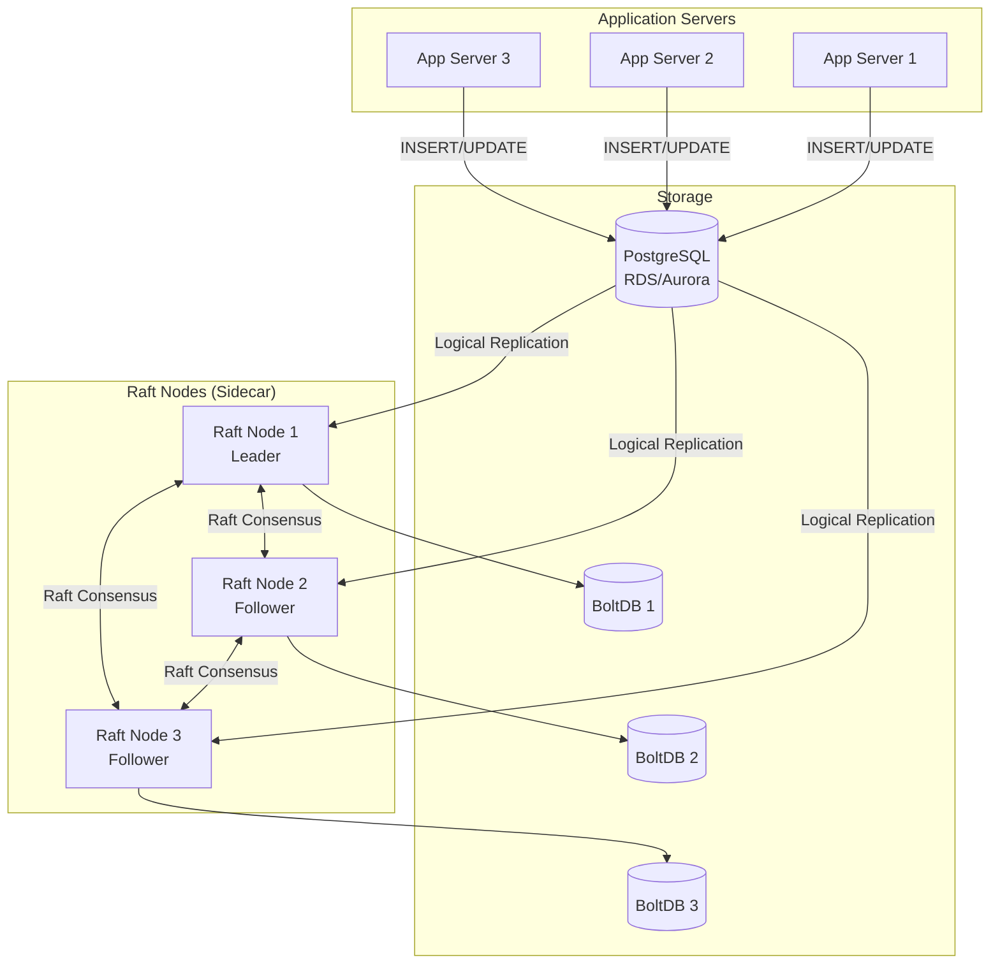
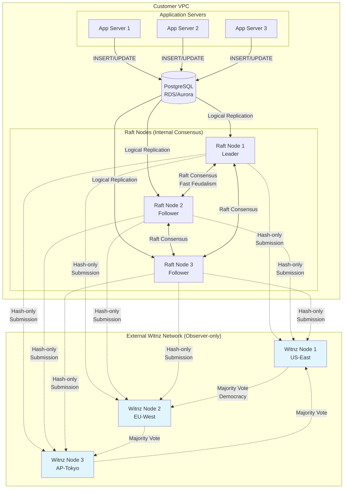
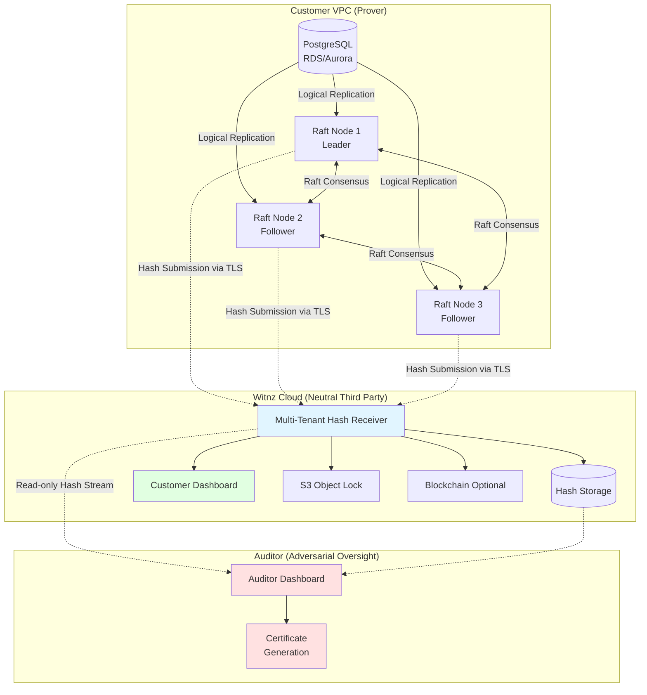
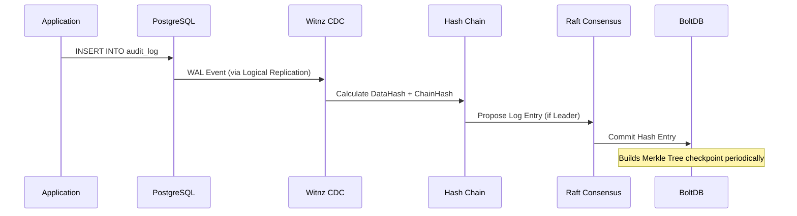
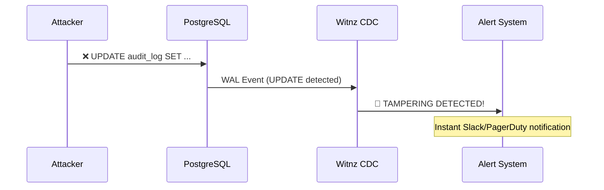
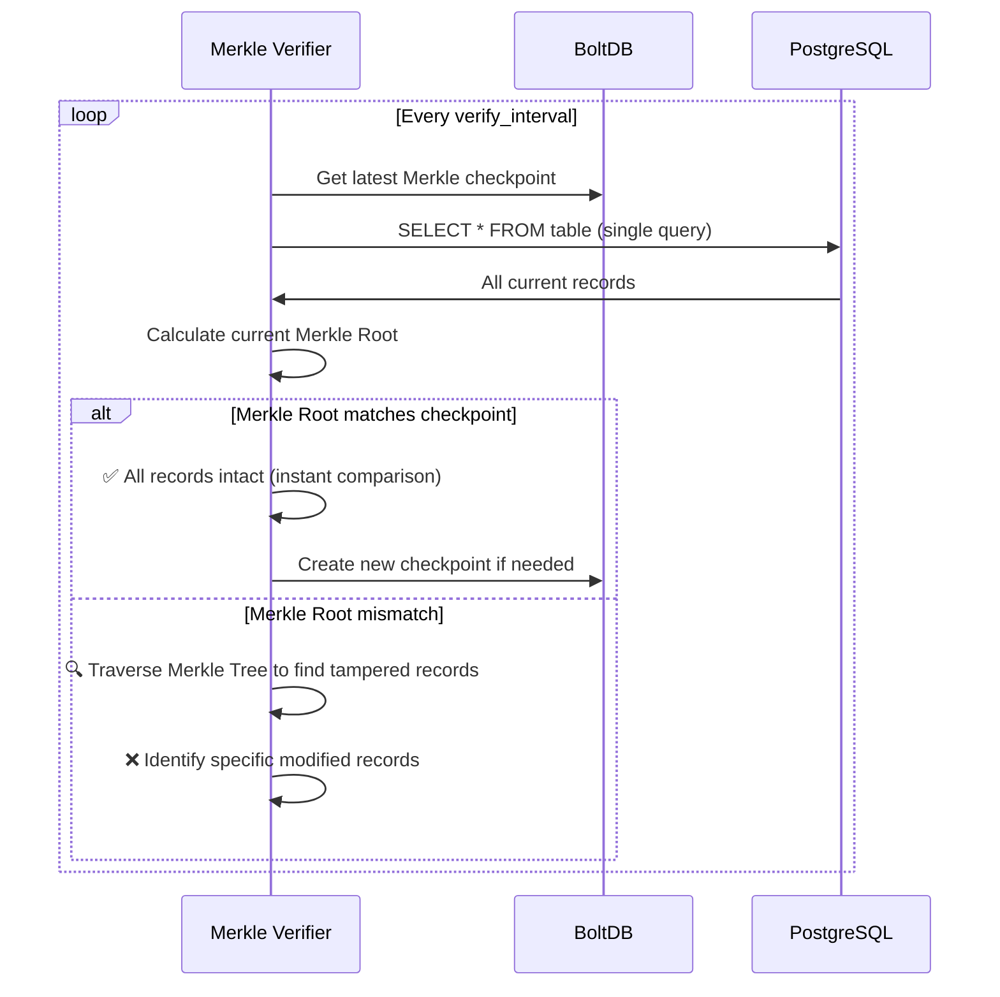
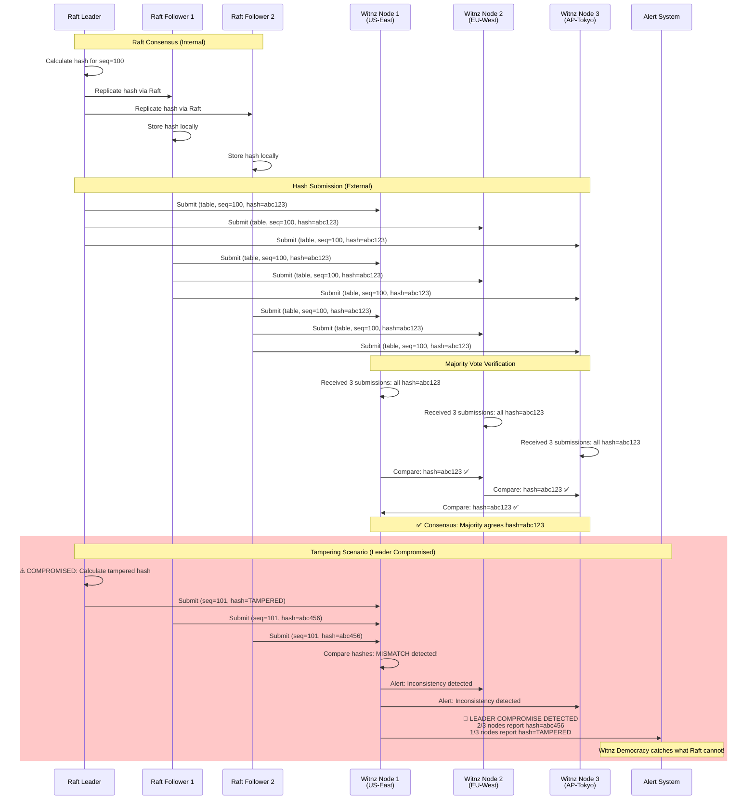

# Witnz - Distributed Consensus Verification Platform

**A new paradigm for distributed consensus verification powered by democratic majority vote.**

## What is Witnz?

Witnz = External verification layer for any consensus system

Witnz is both a **concept** (Proof of Observation) and a **product** (Audit-as-a-Service). A fundamental rethinking of how we verify consensus in distributed systems, delivered as a production-ready SaaS platform.

**The Idea:**
What if we could verify the trustworthiness of any consensus system (Raft, BFT, Paxos) by having known third parties (not anonymous observers) watch and certify what they see? No computation, no complex protocols - just observation by legally accountable entities.

**Important Philosophical Note:**
> Witnz does NOT claim to verify "truth." Witnz verifies **consensus** - what the majority of nodes agree upon. If 1,000,001 nodes report "X" and 1 node reports "Y", Witnz reports that 1,000,001 nodes agree on X. This is **probabilistic reliability**, not absolute truth.

**The Core Innovation:**
- **Traditional systems** create consensus (PoW, PoS, BFT) → Heavy, complex, expensive
- **Witnz** verifies consensus via democratic observation → Lightweight, simple, cheap
- Not a replacement - a new verification layer on top of existing consensus systems

**The Architecture:**
- **Phase 1 (Raft Feudalism)**: Fast internal consensus within your infrastructure
- **Phase 2 (Witnz Democracy)**: External observer nodes verify consensus via majority vote
- **Result**: Best of both worlds - speed + trustless verification

## Beyond Implementation: A Conceptual Framework

This repository implements Witnz for PostgreSQL tampering detection, but the **concept** applies to any system requiring consensus verification:

**Potential Applications of the PoObs Concept:**

- **Database Integrity**: PostgreSQL, MySQL, MongoDB tamper detection
- **File Integrity**: S3, GCS, IPFS content verification
- **Supply Chain**: End-to-end product traceability
- **Voting Systems**: Transparent, verifiable elections
- **IoT Data**: Sensor data integrity verification
- **Scientific Research**: Reproducible research data
- **NFT Metadata**: Permanent metadata persistence

## Proof of Observation (PoObs): A New Consensus Verification Mechanism

Witnz introduces **Proof of Observation (PoObs)** - a novel consensus verification mechanism that verifies what the majority of independent observers witnessed, not what is computationally proven.

### How Proof of Observation Works

**Core Principle:**
> PoObs does NOT create consensus
> PoObs **verifies** consensus by checking what the majority of observers witnessed

**Example:**
```
Internal System (e.g., Raft): Creates consensus → hash value X
External Observers:
  - 1,000,001 observers report: "We observed hash X"
  - 1 observer reports: "I observed hash Y"

PoObs Result: "1,000,001 observers verify hash X"
→ Internal consensus is verified as trustworthy
```

**The Process:**
1. Internal system creates consensus (e.g., Raft cluster agrees on hash values)
2. Multiple independent observer nodes monitor the internal consensus
3. Each observer reports what they witnessed (hash values)
4. Observers perform majority vote verification
5. If majority agrees → consensus is verified; if not → tampering detected
6. No computation required - only observation and comparison

### Why This Matters for Enterprise

**The Problem:**
Traditional database audit is reactive - you discover tampering weeks or months later during periodic audits. By then, the evidence is cold and the damage is done.

**The Solution:**
Witnz provides **continuous, real-time verification** with **independent third-party attestation** - turning audit from a periodic chore into an always-on protection layer.

**Key Innovation:**
- **Three parties verify together**: Customer (Prover) + Witnz Cloud (Neutral) + Auditor (Oversight)
- **Legal standing**: All parties are known, accountable entities (not anonymous observers)
- **Minimal overhead**: 15MB sidecar binary, no schema changes, <1% performance impact

### Attack Resistance through Numbers

**The Power of Observation:**
- Deploy 3 Witnz Nodes → Attacker must compromise 2+ observers
- Deploy 1,001 Witnz Nodes → Attacker must compromise 501+ observers
- Deploy 1,000,001 Witnz Nodes → Attacker must compromise 500,001+ observers

**Key Advantages:**
- Geographic distribution across independent operators
- Automatic node rotation prevents long-term compromise
- Cost scales linearly with security level (add nodes, not computation)
- No mining, no staking - just observation

**Practical Security:**
- Yes, 51% attack is theoretically possible (like any consensus system)
- But: Far more robust than single-point security systems (traditional databases, centralized audit logs)
- Additional protection: External anchoring (S3 Object Lock, blockchain) provides cryptographic proof against all-node compromise
- Reality: Compromising majority of geographically distributed, independently operated nodes is economically infeasible at scale

## Overview for PostgreSQL Use Case

Witnz provides multi-layered protection for PostgreSQL databases, detecting internal fraud and tampering during direct attacks on databases (RDS, Aurora, Cloud SQL, Supabase).

## Key Strengths

### 🪶 Lightweight Sidecar Architecture
- **Single binary (~15MB)** - Deploy as a sidecar to your application servers
- **No complex setup** - Works with existing PostgreSQL databases
- **Zero schema changes** - No modifications to your database required
- **Minimal overhead** - Negligible impact on application performance

### ⚡ Real-time Tamper Detection
- **Instant detection** of unauthorized `UPDATE`/`DELETE` operations on append-only tables
- **PostgreSQL Logical Replication** - Monitors all database changes in real-time
- **Immediate alerts** - Get notified the moment tampering occurs

### 🛡️ Fault-Tolerant & Tamper-Proof
- **Hash-chain structure** - Ensures log immutability with cryptographic guarantees
- **Raft Consensus** - Provides high availability and fault tolerance
- **Multi-node verification** - Prevents single point of compromise
- **Automatic leader election** - Continues operating even when nodes fail

### 🔍 Deep Verification with Merkle Root
- **Fast single-query verification** - Fetches all records in one DB query and compares Merkle Root checkpoints (500x faster than per-record verification)
- **Identifies specific tampered records** - Merkle Tree traversal pinpoints exactly what was modified
- **Catches offline modifications** - Detects direct database attacks and manual tampering
- **Phantom insert detection** - Identifies records added outside the monitoring system
- **Scalable performance** - Verifies millions of records in seconds

## How It Works

### Architecture Overview

#### Phase 1: Raft Feudalism (Current)



#### Phase 2: Witnz Democracy (Next)



**Key Differences:**
- **Raft Nodes (Customer VPC)**: Form internal Raft cluster, have voting rights, fast consensus
- **Witnz Nodes (External)**: Observer-only, no voting rights, receive hash-only submissions
- **Privacy**: Witnz Nodes never see raw data, only cryptographic hashes
- **Consensus Verification**: If Raft Nodes submit different hashes → Majority vote detects tampering

#### Phase 4: The Trinity Consensus (Future)



**The Trinity Model:**
- **Prover (Customer)**: Runs Raft cluster, submits hashes (vested interest in proving integrity)
- **Witnz Cloud (Neutral)**: Independent third-party SaaS, no raw data access, provides legal attestation
- **Auditor (Adversarial)**: External oversight (audit firms, regulators), mutual distrust, independent verification

### Multi-Layered Protection

Witnz provides **two layers** of tamper detection:

#### Layer 1: Real-time CDC Monitoring (Immediate)
- Monitors PostgreSQL Logical Replication stream
- Detects `UPDATE`/`DELETE` operations **instantly**
- Triggers immediate alerts
- Prevents tampering that goes through normal database operations

#### Layer 2: Merkle Root Verification (Periodic)
- Periodically calculates Merkle Root of all table records with single DB query
- Compares with stored Merkle Root checkpoint (instant comparison)
- If mismatch detected, pinpoints specific tampered records via Merkle Tree traversal
- Detects tampering that bypasses Logical Replication:
  - Direct database file modifications
  - Manual SQL executed while nodes were offline
  - Database restores from tampered backups
  - Phantom inserts (records added without INSERT operations)

### Data Flow

#### Write Flow



#### Real-time Tamper Detection



#### Periodic Verification Flow (Merkle Root)



#### Witnz Democracy Verification Flow (Phase 2)



**Key Points:**
- **Raft Feudalism**: Fast internal consensus, but leader's values are trusted
- **Witnz Democracy**: External observers detect when leader's hashes differ from followers
- **Privacy**: Witnz Nodes only receive hashes, never raw database data
- **Majority Vote**: If 2+ Raft Nodes report same hash, but leader differs → Tampering detected

## Protection Capabilities

### What Witnz Detects

| Attack Scenario | Detection Method | Response Time |
|----------------|------------------|---------------|
| `UPDATE`/`DELETE` via SQL | Logical Replication | **Instant** |
| Direct database file modification | Merkle Root verification | **Next verification cycle** |
| Offline tampering (node down) | Merkle Root verification | **On next verification** |
| Phantom inserts (bypass CDC) | Merkle Root verification | **Next verification cycle** |
| Hash chain manipulation | Hash chain integrity check | **Instant** |
| Record deletion | Merkle Root verification | **Next verification cycle** |

### Use Cases

**Audit & Compliance Tables** (Append-only)
- Financial transaction logs
- User activity audit trails
- Contract and consent records
- Change history logs
- Healthcare access logs (HIPAA)
- System event logs (SOC2, ISO27001)

## Quick Start

### Prerequisites

- PostgreSQL 10+ with Logical Replication enabled
- Network connectivity between witnz nodes (VPN/private network recommended)
- Linux/macOS server (amd64 or arm64)

### Installation

```bash
# Linux (amd64)
curl -sSL https://github.com/Anes1032/witnz/releases/latest/download/witnz-linux-amd64 -o /usr/local/bin/witnz
chmod +x /usr/local/bin/witnz

# macOS (arm64)
curl -sSL https://github.com/Anes1032/witnz/releases/latest/download/witnz-darwin-arm64 -o /usr/local/bin/witnz
chmod +x /usr/local/bin/witnz

# Verify installation
witnz version
```

### Configuration

Create `witnz.yaml`:

```yaml
database:
  host: your-rds-endpoint.amazonaws.com
  port: 5432
  database: production
  user: witnz_user
  password: ${WITNZ_DB_PASSWORD}

node:
  id: node1
  bind_addr: node1:7000        # Use hostname for Raft
  grpc_addr: 0.0.0.0:8000
  data_dir: /var/lib/witnz
  bootstrap: true              # Only one node should bootstrap
  peer_addrs:
    node2: node2:7000
    node3: node3:7000

protected_tables:
  - name: audit_logs
    verify_interval: 30m       # Periodic Merkle Root verification

  - name: financial_transactions
    verify_interval: 10m

alerts:
  enabled: true
  slack_webhook: ${SLACK_WEBHOOK_URL}
```

### PostgreSQL Setup

Enable Logical Replication:

```sql
-- Check current setting
SHOW wal_level;  -- Should be 'logical'

-- If not, update postgresql.conf:
-- wal_level = logical
-- max_replication_slots = 10
-- max_wal_senders = 10
-- Then restart PostgreSQL

-- Create witnz user with required permissions
CREATE USER witnz WITH REPLICATION PASSWORD 'secure_password';
GRANT SELECT ON ALL TABLES IN SCHEMA public TO witnz;
ALTER DEFAULT PRIVILEGES IN SCHEMA public GRANT SELECT ON TABLES TO witnz;
```

### Start Witnz

```bash
# Initialize replication slot and publication
witnz init --config witnz.yaml

# Start the node
witnz start --config witnz.yaml

# Check status
witnz status --config witnz.yaml

# Manual verification trigger
witnz verify --config witnz.yaml
```

## Production Deployment

### Multi-Node Setup

Deploy at least **3 nodes** for fault tolerance:

**Node 1 (Bootstrap):**
```yaml
node:
  id: node1
  bootstrap: true
  bind_addr: node1:7000
  peer_addrs:
    node2: node2:7000
    node3: node3:7000
```

**Node 2 & 3 (Followers):**
```yaml
node:
  id: node2              # Change to node3 for third node
  bootstrap: false
  bind_addr: node2:7000  # Change to node3:7000
  peer_addrs:
    node1: node1:7000
    node3: node3:7000    # Adjust peers for each node
```

### Systemd Service

Create `/etc/systemd/system/witnz.service`:

```ini
[Unit]
Description=Witnz PostgreSQL Tamper Detection
After=network.target

[Service]
Type=simple
User=witnz
Group=witnz
ExecStart=/usr/local/bin/witnz start --config /etc/witnz/witnz.yaml
Restart=on-failure
RestartSec=5s

[Install]
WantedBy=multi-user.target
```

Enable and start:
```bash
sudo systemctl daemon-reload
sudo systemctl enable witnz
sudo systemctl start witnz
sudo systemctl status witnz
```

## Development

### Local Development with Docker

```bash
# Clone repository
git clone https://github.com/Anes1032/witnz.git
cd witnz

# Start PostgreSQL + 3 witnz nodes
docker-compose up -d
```

### Building from Source

```bash
# Build single binary
make build

# Build for all platforms
make release

# Run Unit tests
make test
```

### Integration test

```bash
# WAL test
make test-integration


# Merkle tree test
make test-verify
```

## CLI Commands

```bash
witnz init       # Initialize replication slot and publication
witnz start      # Start the node
witnz status     # Display node and cluster status
witnz verify     # Trigger immediate verification
witnz version    # Show version information
```

## Current Status

**v0.1.0 - MVP Released** ✅

Witnz has completed its MVP phase with core Raft Feudalism implementation:

### ✅ Phase 1: Raft Feudalism (COMPLETED)
- **Append-only Mode**: Real-time UPDATE/DELETE detection via PostgreSQL Logical Replication
- **Merkle Root Verification**: Periodic integrity checks with specific tampered record identification
- **Distributed Consensus**: 3-node Raft cluster with automatic failover
- **Leadership Transfer**: Periodic leader rotation to prevent long-term compromise
- **Follower Verification**: Auto-shutdown on inconsistency detection
- **Multi-platform Support**: Single binary for Linux, macOS, Windows (amd64/arm64)
- **Alert System**: Slack webhook integration for tampering alerts

### 🔥 Phase 2: Witnz Democracy - The Core Innovation (IN PROGRESS)

**Goal**: Prove the revolutionary concept - democratic consensus verification via lightweight external observers.

**Core Features**:
- External Witnz Nodes verify Raft consensus via majority vote
- Hash-only mode (privacy-preserving - no raw data access)
- Inconsistency detection catches leader compromise
- Single-region PoC (multi-region deployment in Phase 4)

**Scope**:
- ✅ Single Witnz Node PoC
- ✅ Hash submission protocol (gRPC)
- ✅ Majority vote verification logic
- ❌ External Anchoring (deferred to Phase 3)
- ❌ Multi-region deployment (deferred to Phase 4)

### 📈 Phase 3: Operational Hardening & External Insurance (PLANNED)

**Goal**: Production-ready performance and external anchoring as insurance.

**External Anchoring**:
- S3 Object Lock: Immutable checkpoints (~$0.001/year)
- Blockchain (optional): Ethereum/Bitcoin for compliance
- Purpose: Insurance against all-node compromise

**Performance**:
- Incremental Merkle Tree (billion-record support)
- CDC batch processing (10x throughput)
- Health checks, structured logging, CDC reconnection

### 🏢 Phase 4: The Trinity Consensus - Enterprise/SaaS Model (PLANNED)

**Goal**: Transform Witnz into production-ready Audit-as-a-Service with legally defensible third-party verification.

**Philosophy**: Identity matters more than quantity - "who is observing" > "how many observers"

---

#### The Trinity Consensus: 3-Party Verification

Instead of anonymous observers, The Trinity relies on **identity and role** of three parties:

**1. Prover Node (Customer Infrastructure)**
- Customer's Raft cluster in their VPC
- Data owner proving integrity
- Runs witnz-agent (Go binary sidecar)
- Submits hash chains to Witnz Cloud

**2. Witnz Cloud (Neutral Third Party)**
- SaaS provider operated by Witnz
- Multi-tenant hash preservation
- No raw data access (hash-only)
- Independent verification and timestamping

**3. Auditor Node (Adversarial Oversight)**
- External audit firms or regulators
- Adversarial verification layer
- Legal standing and accountability
- Optional: Customer's existing auditor (Big 4, etc.)

**Why Trinity > Anonymous Observers:**
- **Legal standing**: Known third parties can testify in court
- **No Sybil attacks**: Requires business contracts and payment
- **Compliance-ready**: Auditor participation built-in
- **Simple monetization**: Subscription model (no token complexity)

---

#### SaaS Business Model: Audit-as-a-Service

**Customer Deployment:**
- Install witnz-agent in customer VPC (auto-connects to Witnz Cloud)
- Zero-touch onboarding with API key
- Hash-only submission (no raw data leaves infrastructure)

**Witnz Cloud Infrastructure:**
- Multi-tenant gRPC hash receiver (supports 1000+ customers)
- Customer dashboard (real-time integrity status, alerts)
- Automatic anchoring (S3 Object Lock + optional blockchain)
- PDF certificate generation for audits (SOC2, ISO27001)

**Auditor Portal:**
- Customers invite auditors via email/API
- Read-only hash stream access
- Independent verification without customer involvement
- Signed attestation reports

**Value Proposition:**
- **"Set it and forget it"**: Deploy once, automatic protection forever
- **Audit cost reduction**: Pre-generated compliance evidence (30-50% time savings)
- **Internal fraud deterrence**: Employees know tampering is externally verified
- **Customer transparency**: "Verified by Witnz" trust badge

**Pricing Model:**
- Starter: $99/month per table (up to 1M records)
- Professional: $499/month (unlimited tables, 10M records, auditor access)
- Enterprise: Custom (multi-region, dedicated nodes, blockchain anchoring, SLA)

---

**Key Differentiator:**
> **Traditional Audit**: Single point of trust (the auditor)
> **Blockchain**: Expensive computational proof (overkill for most use cases)
> **Witnz Trinity**: Three-party verification with legal standing - practical, affordable, compliance-ready

## Architecture & Technology

### Tech Stack

| Component | Technology | Purpose |
|-----------|-----------|---------|
| Language | Go | Single binary, easy deployment |
| CDC | PostgreSQL Logical Replication | Real-time change detection |
| Consensus | Raft (hashicorp/raft) | Distributed consensus |
| Storage | BoltDB (bbolt) | Embedded key-value store |
| Hash | SHA256 | Cryptographic integrity |
| Alerts | Slack webhooks | Instant notifications |

### Why Witnz? Comparison with Enterprise Audit Solutions

Witnz is **Audit-as-a-Service** - continuous database integrity verification with independent third-party attestation.

| Aspect | Traditional Manual Audit | pgaudit + S3 Logs | immudb / QLDB | Witnz (Trinity Consensus) |
|--------|--------------------------|-------------------|---------------|---------------------------|
| **Verification Timing** | Periodic (annual, quarterly) | Post-hoc log review | Real-time (within system) | Real-time + Independent third party |
| **Third-Party Attestation** | Auditor signs off after review | None (self-attestation) | None (self-attestation) | Witnz Cloud + Optional external auditor |
| **Tamper Detection** | After the fact (weeks/months later) | Reactive (if someone checks logs) | Within database only | Immediate + External verification |
| **Legal Standing** | High (Big 4 auditor signature) | Low (customer's own logs) | Medium (proprietary system) | High (neutral third party + auditor) |
| **Deployment Complexity** | Minimal (auditor visits) | Medium (log management) | High (new database, migration) | Low (sidecar binary, no schema changes) |
| **Cost** | Very high ($50K-$500K+ per audit) | Low (storage costs) | Medium-High (licensing, migration) | Medium ($99-$499/month per table) |
| **Continuous Monitoring** | ❌ No | ⚠️ Possible but manual | ✅ Yes | ✅ Yes + External verification |
| **Compliance Ready** | ✅ Yes (SOC2, ISO27001) | ⚠️ Partial (evidence only) | ⚠️ Partial (proprietary) | ✅ Yes (PDF certificates, auditor access) |

#### Witnz's Unique Position

**vs Traditional Manual Audit:**
- Continuous real-time verification (not periodic sampling)
- Pre-generated compliance evidence (30-50% audit time savings)
- Neutral third-party attestation included

**vs pgaudit + S3 Logs:**
- Active verification, not passive logging
- Independent third party (Witnz Cloud) provides legal attestation
- Built-in auditor access portal

**vs immudb / Amazon QLDB:**
- No database migration required (works with existing PostgreSQL)
- External verification layer (not just internal guarantees)
- True third-party attestation (not self-attestation)

**vs Hyperledger Fabric:**
- 1000x lighter (15MB binary vs multi-GB infrastructure)
- No blockchain complexity (simple B2B SaaS model)
- Legal standing through known third parties (not computational proof)

**Key Differentiators:**
- **The Trinity Model**: Customer + Witnz Cloud + Auditor = three-party verification
- **Legal standing**: Known, accountable third parties (not anonymous observers)
- **Zero migration**: Works with existing PostgreSQL (RDS, Aurora, Cloud SQL, Supabase)
- **Audit-ready**: PDF certificates, compliance reports, auditor portal included

## Consensus Verification Guarantees

**Witnz is a distributed consensus verification platform, not a traditional security tool.** Witnz does not claim to verify "truth" - it verifies **what the majority of nodes agree upon**. This is probabilistic reliability through democratic consensus, not absolute truth.

### Phase 1 (Raft Feudalism) Guarantees

**What Raft guarantees:**
- Hash chain length is consistent across nodes (term magnitude)
- Fast internal consensus within your infrastructure
- Automatic recovery from node failures

**What Raft does NOT guarantee:**
- Leader's hash values are correct (leader compromise undetectable)
- This is intentional - feudalism prioritizes speed over verification

### Phase 2 (Witnz Democracy) Guarantees

**What Witnz Democracy adds:**
- External observer nodes verify hash values via majority vote
- Detects leader compromise that Raft cannot catch
- Zero-trust verification layer (mutual distrust between observers)
- Attack resistance scales with number of observers (see "Attack Resistance through Numbers" above)

### Technical Implementation

- **SHA256 cryptographic hashing** for all hash chains
- **Raft consensus** for internal cluster coordination
- **Merkle Tree verification** for efficient integrity checking
- **PostgreSQL Logical Replication** for change detection
- **Democratic majority vote** for external consensus verification

### Future Enhancements (Phase 3-4)

- TLS/mTLS for inter-node communication
- Encryption at rest for local storage
- External anchoring (S3 Object Lock, blockchain) for compliance
- HSM integration for key management
- Multi-tenant Witnz Cloud SaaS platform
- Auditor portal with independent verification
- PDF certificate generation for SOC2/ISO27001 audits

## Contributing

We welcome contributions! Development guidelines:

- All code and comments in English
- Minimal code comments - prefer self-documenting code
- Follow Go best practices
- Write tests for new features
- See [doc/](doc/) for detailed architecture

## License

MIT License

## Support

- GitHub Issues: https://github.com/Anes1032/witnz/issues
- Documentation: [doc/](doc/)

## Acknowledgments

Witnz is built on excellent open source projects:
- [hashicorp/raft](https://github.com/hashicorp/raft) - Distributed consensus
- [jackc/pgx](https://github.com/jackc/pgx) - PostgreSQL driver and logical replication
- [etcd-io/bbolt](https://github.com/etcd-io/bbolt) - Embedded key-value database
