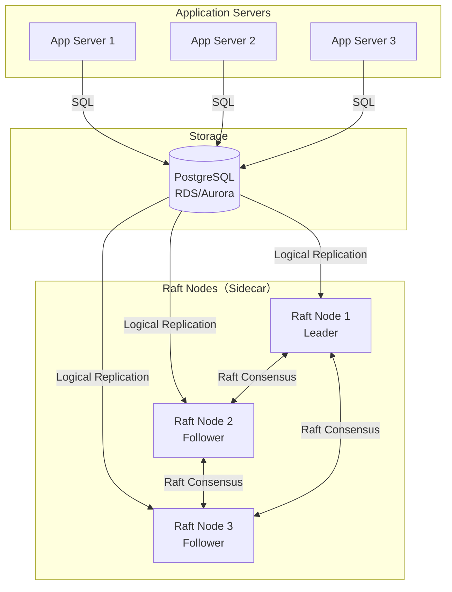

# Witnz - Lightweight PostgreSQL Tamper Detection

**A lightweight tamper detection tool for PostgreSQL using distributed consensus.**

## What is Witnz?

Witnz is a sidecar monitoring tool that detects unauthorized modifications to PostgreSQL databases in real-time. It uses Raft consensus to maintain tamper-proof hash chains across multiple nodes.

## Key Features

### Lightweight Deployment
- Single binary (~15MB) - Deploy as a sidecar to your application servers
- No schema changes - Works with existing PostgreSQL databases
- Minimal overhead - Uses PostgreSQL Logical Replication for change detection

### Real-time Monitoring
- Instant detection of unauthorized `UPDATE`/`DELETE` operations on append-only tables
- Periodic Merkle Root verification to catch offline tampering
- Immediate Slack alerts when tampering is detected

### Distributed Consensus
- 3-node Raft cluster for fault tolerance
- Automatic leader election and failover
- Cryptographic hash chains prevent tampering

## How It Works



### Protection Layers

**Layer 1: Real-time CDC Monitoring**
- Monitors PostgreSQL Logical Replication stream
- Detects `UPDATE`/`DELETE` operations instantly
- Triggers immediate alerts

**Layer 2: Merkle Root Verification**
- Periodically calculates Merkle Root of all table records
- Compares with stored checkpoint
- Detects offline tampering and phantom inserts

## Quick Start

### Prerequisites

- PostgreSQL 10+ with Logical Replication enabled
- Network connectivity between witnz nodes
- Linux/macOS server (amd64 or arm64)

### Installation

```bash
# Linux (amd64)
curl -sSL https://github.com/Anes1032/witnz/releases/latest/download/witnz-linux-amd64 -o /usr/local/bin/witnz
chmod +x /usr/local/bin/witnz

# Verify installation
witnz version
```

### Configuration

Create `witnz.yaml`:

```yaml
database:
  host: your-db-host.com
  port: 5432
  database: production
  user: witnz_user
  password: ${WITNZ_DB_PASSWORD}

node:
  id: node1
  bind_addr: node1:7000
  grpc_addr: 0.0.0.0:8000
  data_dir: /var/lib/witnz
  bootstrap: true
  peer_addrs:
    node2: node2:7000
    node3: node3:7000

protected_tables:
  - name: audit_logs
    verify_interval: 30m

alerts:
  enabled: true
  slack_webhook: ${SLACK_WEBHOOK_URL}
```

### PostgreSQL Setup

```sql
-- Enable Logical Replication
-- Add to postgresql.conf:
-- wal_level = logical
-- max_replication_slots = 10
-- max_wal_senders = 10

-- Create witnz user
CREATE USER witnz WITH REPLICATION PASSWORD 'secure_password';
GRANT SELECT ON ALL TABLES IN SCHEMA public TO witnz;
```

### Start Witnz

```bash
witnz init --config witnz.yaml
witnz start --config witnz.yaml
witnz status --config witnz.yaml
```

## Multi-Node Setup

Deploy at least **3 nodes** for fault tolerance:

**Node 1 (Bootstrap):**
```yaml
node:
  id: node1
  bootstrap: true
  bind_addr: node1:7000
  peer_addrs:
    node2: node2:7000
    node3: node3:7000
```

**Node 2 & 3 (Followers):**
```yaml
node:
  id: node2
  bootstrap: false
  bind_addr: node2:7000
  peer_addrs:
    node1: node1:7000
    node3: node3:7000
```

## Use Cases

**Audit & Compliance Tables** (Append-only)
- Financial transaction logs
- User activity audit trails
- Contract and consent records
- Healthcare access logs (HIPAA)
- System event logs (SOC2, ISO27001)

## Architecture

### Tech Stack

| Component | Technology | Purpose |
|-----------|-----------|---------|
| Language | Go | Single binary, easy deployment |
| CDC | PostgreSQL Logical Replication | Real-time change detection |
| Consensus | Raft (hashicorp/raft) | Distributed consensus |
| Storage | BoltDB (bbolt) | Embedded key-value store |
| Hash | SHA256 | Cryptographic integrity |
| Alerts | Slack webhooks | Instant notifications |

### What Witnz Detects

| Attack Scenario | Detection Method | Response Time |
|----------------|------------------|---------------|
| `UPDATE`/`DELETE` via SQL | Logical Replication | **Instant** |
| Direct database file modification | Merkle Root verification | **Next verification cycle** |
| Offline tampering | Merkle Root verification | **On next verification** |
| Phantom inserts | Merkle Root verification | **Next verification cycle** |
| Record deletion | Merkle Root verification | **Next verification cycle** |

## Development

### Local Development with Docker

```bash
git clone https://github.com/Anes1032/witnz.git
cd witnz
docker-compose up -d
```

### Building from Source

```bash
make build
make test
```

### Integration Tests

```bash
make test-append-only    # Real-time detection test
make test-verify         # Merkle Root verification test
```

## Current Status

### Implemented Features
- Append-only mode with real-time UPDATE/DELETE detection
- Merkle Root verification with specific tampered record identification
- 3-node Raft cluster with automatic failover
- PostgreSQL Logical Replication integration
- Slack webhook alerts
- Multi-platform support (Linux, macOS, Windows)

## Comparison with immudb

**Current Robustness:**

Witnz currently has **lower robustness** compared to immudb in terms of tamper resistance:

| Aspect | immudb | Witnz (Current - v0.1.0) |
|--------|--------|--------------------------|
| **Architecture** | Purpose-built immutable database | Sidecar monitoring tool for PostgreSQL |
| **Leader Compromise** | Detectable (built-in cryptographic proofs) | **Not detectable** (Raft followers trust leader) |
| **Data Model** | Immutable append-only ledger | PostgreSQL monitoring with hash chains |
| **Migration Required** | Yes (switch to immudb database) | No (works with existing PostgreSQL) |
| **Deployment** | Replace database entirely | Add sidecar binary |

**Witnz's Limitation:**

The current Raft-based implementation has a fundamental weakness: if the Raft leader is compromised, it can submit false hash values that followers will accept without verification. immudb does not have this limitation as it uses cryptographic proofs throughout.

**Future Direction:**

We are investigating external verification mechanisms to address this limitation while maintaining the lightweight, no-migration advantage.

## CLI Commands

```bash
witnz init       # Initialize replication slot and publication
witnz start      # Start the node
witnz status     # Display node and cluster status
witnz verify     # Trigger immediate verification
witnz version    # Show version information
```

## Contributing

We welcome contributions! Development guidelines:

- All code and comments in English
- Minimal code comments - prefer self-documenting code
- Follow Go best practices
- Write tests for new features

## License

MIT License

## Support

- GitHub Issues: https://github.com/Anes1032/witnz/issues
- Documentation: [doc/](doc/)

## Acknowledgments

Witnz is built on excellent open source projects:
- [hashicorp/raft](https://github.com/hashicorp/raft) - Distributed consensus
- [jackc/pgx](https://github.com/jackc/pgx) - PostgreSQL driver and logical replication
- [etcd-io/bbolt](https://github.com/etcd-io/bbolt) - Embedded key-value database
