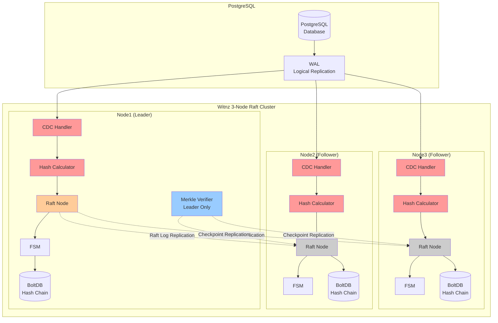

# Witnz - Lightweight PostgreSQL Tamper Detection

**A lightweight tamper detection tool for PostgreSQL using distributed consensus.**

## What is Witnz?

Witnz is a sidecar monitoring tool that detects unauthorized modifications to PostgreSQL databases in real-time. It uses Raft consensus to maintain tamper-proof hash chains across multiple nodes.

## Key Features

### Lightweight Deployment
- Single binary (~15MB) - Deploy as a sidecar to your application servers
- No schema changes - Works with existing PostgreSQL databases
- Minimal overhead - Uses PostgreSQL Logical Replication for change detection

### Real-time Monitoring
- Instant detection of unauthorized `UPDATE`/`DELETE` operations on append-only tables
- Periodic Merkle Root verification to catch offline tampering
- Immediate Slack alerts when tampering is detected

### Distributed Consensus
- 3-node Raft cluster for fault tolerance
- Automatic leader election and failover
- Cryptographic hash chains prevent tampering

## Comparison with Other Solutions

| Solution | Migration Required | Deployment | Trust Model |
|----------|-------------------|------------|-------------|
| **Witnz** | No | Sidecar binary (~15MB) | Distributed Raft nodes |
| **pgaudit** | No | PostgreSQL extension | Single server logs |
| **immudb** | Yes (full DB replacement) | Dedicated database | immudb server |
| **Amazon QLDB** | Yes (full DB replacement) | AWS managed service | AWS infrastructure |
| **Hyperledger Fabric** | Yes (new infrastructure) | Multi-GB blockchain | Consortium nodes |

### vs pgaudit
- pgaudit only logs queries; Witnz actively verifies data integrity
- pgaudit logs can be tampered; Witnz uses distributed hash chains
- Witnz provides real-time alerts on tampering

### vs immudb / Amazon QLDB
- No migration required - works with existing PostgreSQL
- Same trust model (see Security Considerations below)
- Significantly lower deployment cost

### vs Hyperledger Fabric
- 1000x lighter (~15MB vs multi-GB infrastructure)
- Hours to deploy vs weeks/months
- No blockchain complexity

## How It Works



### Protection Layers

**Layer 1: Real-time CDC Monitoring**
- Monitors PostgreSQL Logical Replication stream
- Detects `UPDATE`/`DELETE` operations instantly
- Triggers immediate alerts

**Layer 2: Merkle Root Verification**
- Periodically calculates Merkle Root of all table records
- Compares with stored checkpoint
- Detects offline tampering and phantom inserts

## Quick Start

### Prerequisites

- PostgreSQL 10+ with Logical Replication enabled
- Network connectivity between witnz nodes
- Linux/macOS server (amd64 or arm64)

### Installation

```bash
# Linux (amd64)
curl -sSL https://github.com/Anes1032/witnz/releases/latest/download/witnz-linux-amd64 -o /usr/local/bin/witnz
chmod +x /usr/local/bin/witnz

# Verify installation
witnz version
```

### Configuration

Create `config/witnz.yaml` (see [detailed configuration guide](config/README.md)):

**For Development/Testing:**
```yaml
database:
  host: localhost
  port: 5432
  database: mydb
  user: witnz
  password: test_password  # OK for testing only

hash:
  algorithm: sha256

node:
  id: node1
  bind_addr: 0.0.0.0:7000
  data_dir: /data/witnz
  bootstrap: true
  peer_addrs:
    node2: node2:7000
    node3: node3:7000

protected_tables:
  - name: audit_log
    verify_interval: 30s
```

**For Production (REQUIRED):**
```yaml
database:
  host: ${DB_HOST}         # Environment variable
  port: ${DB_PORT}         # Environment variable
  database: ${DB_NAME}     # Environment variable
  user: ${DB_USER}         # Environment variable
  password: ${DB_PASSWORD} # Environment variable

hash:
  algorithm: sha256

node:
  id: node1
  bind_addr: 0.0.0.0:7000
  data_dir: /data/witnz
  bootstrap: true
  peer_addrs:
    node2: node2:7000
    node3: node3:7000

protected_tables:
  - name: audit_log
    verify_interval: 30s

alerts:
  enabled: true
  slack_webhook: ${SLACK_WEBHOOK_URL}
```

⚠️ **Security Note**: Production environments MUST use environment variables for all sensitive data (database credentials, webhook URLs). Never commit plain text credentials to version control. See [config/README.md](config/README.md) for detailed security guidance.

For complete configuration options including cluster setup, see [config/README.md](config/README.md).

### PostgreSQL Setup

```sql
-- Enable Logical Replication
-- Add to postgresql.conf:
-- wal_level = logical
-- max_replication_slots = 10
-- max_wal_senders = 10

-- Create witnz user
CREATE USER witnz WITH REPLICATION PASSWORD 'secure_password';
GRANT SELECT ON ALL TABLES IN SCHEMA public TO witnz;
```

### Start Witnz

```bash
witnz init
witnz start
witnz status
```

## Use Cases

**Audit & Compliance Tables** (Append-only)
- Financial transaction logs
- User activity audit trails
- Contract and consent records
- Healthcare access logs (HIPAA)
- System event logs (SOC2, ISO27001)

## Architecture

### Tech Stack

| Component | Technology | Purpose |
|-----------|-----------|---------|
| Language | Go | Single binary, easy deployment |
| CDC | PostgreSQL Logical Replication | Real-time change detection |
| Consensus | Raft (hashicorp/raft) | Distributed consensus |
| Storage | BoltDB (bbolt) | Embedded key-value store |
| Hash | Multi options (eg. SHA256) | Cryptographic integrity |
| Alerts | Slack webhooks | Instant notifications |

### What Witnz Detects

| Attack Scenario | Detection Method | Response Time |
|----------------|------------------|---------------|
| `UPDATE`/`DELETE` via SQL | Logical Replication | **Instant** |
| Direct database file modification | Merkle Root verification | **Next verification cycle** |
| Offline tampering | Merkle Root verification | **On next verification** |
| Phantom inserts | Merkle Root verification | **Next verification cycle** |
| Record deletion | Merkle Root verification | **Next verification cycle** |

## Development

### Local Development with Docker

```bash
git clone https://github.com/Anes1032/witnz.git
cd witnz
docker-compose up -d
```

### Building from Source

```bash
make build
```

### Unit Tests

```bash
make test
```

### Integration Tests

```bash
make test-integration
```

## Current Status

### Implemented Features
- Real-time UPDATE/DELETE detection
- Merkle Root verification with specific tampered record identification
- Raft cluster with automatic failover
- PostgreSQL Logical Replication integration
- Slack webhook alerts
- Multi-platform support (Linux, macOS)

## Security Considerations

### Raft Leader Compromise

Witnz has a fundamental limitation: if a Raft leader node is compromised with **root access**, it can submit false hash values that followers will accept.

**However, this requires:**
- Root access to the leader node's server
- Ability to modify the running binary or restart with a tampered version

### The Same Applies to Other Solutions

| Solution | Server Root Compromise |
|----------|----------------------|
| **Witnz** | Attacker can submit false hashes |
| **immudb** | Attacker can submit false data and proofs |
| **Amazon QLDB** | Attacker with AWS access can manipulate |
| **Any software** | Root access = full control |

**No software-only solution can protect against server root compromise.** This is a fundamental limitation shared by all database integrity tools, including immudb.

The only theoretical protection is hardware-based root of trust (TPM, AWS Nitro Enclave, Intel SGX), which requires trusting the hardware vendor.

### What Witnz Protects Against

- Database administrator misconduct (without server root access)
- SQL injection attacks modifying audit records
- Direct database file tampering (detected via Merkle Root)
- Application-level bugs causing unauthorized modifications

## CLI Commands

```bash
witnz init       # Initialize replication slot and publication
witnz start      # Start the node
witnz status     # Display node and cluster status
witnz verify     # Trigger immediate verification
witnz version    # Show version information
```

## Contributing

We welcome contributions! Development guidelines:

- All code and comments in English
- Minimal code comments - prefer self-documenting code
- Follow Go best practices
- Write tests for new features

## License

MIT License

## Support

- GitHub Issues: https://github.com/Anes1032/witnz/issues

## Acknowledgments

Witnz is built on excellent open source projects:
- [hashicorp/raft](https://github.com/hashicorp/raft) - Distributed consensus
- [jackc/pgx](https://github.com/jackc/pgx) - PostgreSQL driver and logical replication
- [etcd-io/bbolt](https://github.com/etcd-io/bbolt) - Embedded key-value database
