# Witnz - PostgreSQL Tamper Detection System

A distributed database tampering detection system for PostgreSQL that provides lightweight, blockchain-inspired tamper detection capabilities.

## Overview

Witnz is designed to detect internal fraud by database administrators and tampering during direct attacks on databases (RDS, Aurora, Cloud SQL, Supabase). It provides multi-layered protection through real-time monitoring and periodic verification.

## Key Strengths

### 🪶 Lightweight Sidecar Architecture
- **Single binary (~15MB)** - Deploy as a sidecar to your application servers
- **No complex setup** - Works with existing PostgreSQL databases
- **Zero schema changes** - No modifications to your database required
- **Minimal overhead** - Negligible impact on application performance

### ⚡ Real-time Tamper Detection
- **Instant detection** of unauthorized `UPDATE`/`DELETE` operations on append-only tables
- **PostgreSQL Logical Replication** - Monitors all database changes in real-time
- **Immediate alerts** - Get notified the moment tampering occurs

### 🛡️ Fault-Tolerant & Tamper-Proof
- **Hash-chain structure** - Ensures log immutability with cryptographic guarantees
- **Raft Consensus** - Provides high availability and fault tolerance
- **Multi-node verification** - Prevents single point of compromise
- **Automatic leader election** - Continues operating even when nodes fail

### 🔍 Deep Verification with Merkle Root
- **Fast single-query verification** - Fetches all records in one DB query and compares Merkle Root checkpoints (500x faster than per-record verification)
- **Identifies specific tampered records** - Merkle Tree traversal pinpoints exactly what was modified
- **Catches offline modifications** - Detects direct database attacks and manual tampering
- **Phantom insert detection** - Identifies records added outside the monitoring system
- **Scalable performance** - Verifies millions of records in seconds

## How It Works

### Architecture Overview


### Multi-Layered Protection

Witnz provides **two layers** of tamper detection:

#### Layer 1: Real-time CDC Monitoring (Immediate)
- Monitors PostgreSQL Logical Replication stream
- Detects `UPDATE`/`DELETE` operations **instantly**
- Triggers immediate alerts
- Prevents tampering that goes through normal database operations

#### Layer 2: Merkle Root Verification (Periodic)
- Periodically calculates Merkle Root of all table records with single DB query
- Compares with stored Merkle Root checkpoint (instant comparison)
- If mismatch detected, pinpoints specific tampered records via Merkle Tree traversal
- Detects tampering that bypasses Logical Replication:
  - Direct database file modifications
  - Manual SQL executed while nodes were offline
  - Database restores from tampered backups
  - Phantom inserts (records added without INSERT operations)

### Data Flow

#### Write Flow


#### Real-time Tamper Detection

```mermaid
sequenceDiagram
    participant Attacker as Attacker
    participant PG as PostgreSQL
    participant CDC as Witnz CDC
    participant Alert as Alert System

    Attacker->>PG: ❌ UPDATE audit_log SET ...
    PG->>CDC: WAL Event (UPDATE detected)
    CDC->>Alert: 🚨 TAMPERING DETECTED!
    Note over Alert: Instant Slack/PagerDuty notification
```



#### Periodic Verification Flow (Merkle Root)

```mermaid
sequenceDiagram
    participant Verifier as Merkle Verifier
    participant Storage as BoltDB
    participant PG as PostgreSQL

    loop Every verify_interval
        Verifier->>Storage: Get latest Merkle checkpoint
        Verifier->>PG: SELECT * FROM table (single query)
        PG->>Verifier: All current records
        Verifier->>Verifier: Calculate current Merkle Root
        alt Merkle Root matches checkpoint
            Verifier->>Verifier: ✅ All records intact (instant comparison)
            Verifier->>Storage: Create new checkpoint if needed
        else Merkle Root mismatch
            Verifier->>Verifier: 🔍 Traverse Merkle Tree to find tampered records
            Verifier->>Verifier: ❌ Identify specific modified records
        end
    end
```



## Protection Capabilities

### What Witnz Detects

| Attack Scenario | Detection Method | Response Time |
|----------------|------------------|---------------|
| `UPDATE`/`DELETE` via SQL | Logical Replication | **Instant** |
| Direct database file modification | Merkle Root verification | **Next verification cycle** |
| Offline tampering (node down) | Merkle Root verification | **On next verification** |
| Phantom inserts (bypass CDC) | Merkle Root verification | **Next verification cycle** |
| Hash chain manipulation | Hash chain integrity check | **Instant** |
| Record deletion | Merkle Root verification | **Next verification cycle** |

### Use Cases

**Audit & Compliance Tables** (Append-only)
- Financial transaction logs
- User activity audit trails
- Contract and consent records
- Change history logs
- Healthcare access logs (HIPAA)
- System event logs (SOC2, ISO27001)

## Quick Start

### Prerequisites

- PostgreSQL 10+ with Logical Replication enabled
- Network connectivity between witnz nodes (VPN/private network recommended)
- Linux/macOS server (amd64 or arm64)

### Installation

```bash
# Linux (amd64)
curl -sSL https://github.com/Anes1032/witnz/releases/latest/download/witnz-linux-amd64 -o /usr/local/bin/witnz
chmod +x /usr/local/bin/witnz

# macOS (arm64)
curl -sSL https://github.com/Anes1032/witnz/releases/latest/download/witnz-darwin-arm64 -o /usr/local/bin/witnz
chmod +x /usr/local/bin/witnz

# Verify installation
witnz version
```

### Configuration

Create `witnz.yaml`:

```yaml
database:
  host: your-rds-endpoint.amazonaws.com
  port: 5432
  database: production
  user: witnz_user
  password: ${WITNZ_DB_PASSWORD}

node:
  id: node1
  bind_addr: node1:7000        # Use hostname for Raft
  grpc_addr: 0.0.0.0:8000
  data_dir: /var/lib/witnz
  bootstrap: true              # Only one node should bootstrap
  peer_addrs:
    node2: node2:7000
    node3: node3:7000

protected_tables:
  - name: audit_logs
    verify_interval: 30m       # Periodic Merkle Root verification

  - name: financial_transactions
    verify_interval: 10m

alerts:
  enabled: true
  slack_webhook: ${SLACK_WEBHOOK_URL}
```

### PostgreSQL Setup

Enable Logical Replication:

```sql
-- Check current setting
SHOW wal_level;  -- Should be 'logical'

-- If not, update postgresql.conf:
-- wal_level = logical
-- max_replication_slots = 10
-- max_wal_senders = 10
-- Then restart PostgreSQL

-- Create witnz user with required permissions
CREATE USER witnz WITH REPLICATION PASSWORD 'secure_password';
GRANT SELECT ON ALL TABLES IN SCHEMA public TO witnz;
ALTER DEFAULT PRIVILEGES IN SCHEMA public GRANT SELECT ON TABLES TO witnz;
```

### Start Witnz

```bash
# Initialize replication slot and publication
witnz init --config witnz.yaml

# Start the node
witnz start --config witnz.yaml

# Check status
witnz status --config witnz.yaml

# Manual verification trigger
witnz verify --config witnz.yaml
```

## Production Deployment

### Multi-Node Setup

Deploy at least **3 nodes** for fault tolerance:

**Node 1 (Bootstrap):**
```yaml
node:
  id: node1
  bootstrap: true
  bind_addr: node1:7000
  peer_addrs:
    node2: node2:7000
    node3: node3:7000
```

**Node 2 & 3 (Followers):**
```yaml
node:
  id: node2              # Change to node3 for third node
  bootstrap: false
  bind_addr: node2:7000  # Change to node3:7000
  peer_addrs:
    node1: node1:7000
    node3: node3:7000    # Adjust peers for each node
```

### Systemd Service

Create `/etc/systemd/system/witnz.service`:

```ini
[Unit]
Description=Witnz PostgreSQL Tamper Detection
After=network.target

[Service]
Type=simple
User=witnz
Group=witnz
ExecStart=/usr/local/bin/witnz start --config /etc/witnz/witnz.yaml
Restart=on-failure
RestartSec=5s

[Install]
WantedBy=multi-user.target
```

Enable and start:
```bash
sudo systemctl daemon-reload
sudo systemctl enable witnz
sudo systemctl start witnz
sudo systemctl status witnz
```

## Development

### Local Development with Docker

```bash
# Clone repository
git clone https://github.com/Anes1032/witnz.git
cd witnz

# Start PostgreSQL + 3 witnz nodes
docker-compose up -d
```

### Building from Source

```bash
# Build single binary
make build

# Build for all platforms
make release

# Run Unit tests
make test
```

### Integration test

```bash
# WAL test
make test-integration


# Merkle tree test
make test-verify
```

## CLI Commands

```bash
witnz init       # Initialize replication slot and publication
witnz start      # Start the node
witnz status     # Display node and cluster status
witnz verify     # Trigger immediate verification
witnz version    # Show version information
```

## Current Status## Current Status

**v0.1.0 - MVP Released** ✅

Witnz has completed its MVP phase with core tamper detection capabilities:

### ✅ Implemented Features
- **Append-only Mode**: Real-time UPDATE/DELETE detection via PostgreSQL Logical Replication
- **Merkle Root Verification**: Periodic integrity checks with specific tampered record identification
- **Distributed Consensus**: 3-node Raft cluster with automatic failover
- **Multi-platform Support**: Single binary for Linux, macOS, Windows (amd64/arm64)
- **Alert System**: Slack webhook integration for tampering alerts

### 🔥 Phase 2: Core Technical Innovation (IN PROGRESS)

**Goal**: Establish absolute technical superiority through revolutionary features that competitors cannot replicate.

**Priority 1: Multi-region Witness Nodes & Zero-Trust Architecture**
- Geographic distribution with high-latency Raft consensus (150ms+ RTT)
- Witness node role: External validators that participate in consensus without accessing customer data
- Hash-only mode: Witness nodes verify integrity using only cryptographic hashes (data privacy protection)
- Automated witness rotation: Replace nodes every 7 days to prevent long-term attacks

**Priority 2: External Anchoring (Tamper-proof External Proof)**
- S3 Object Lock integration: Immutable checkpoints to detect all-node tampering (~$0.001/year cost)
- Blockchain anchoring (optional): Ethereum/Bitcoin integration for compliance-grade proof

**Priority 3: Performance Optimizations**
- Incremental Merkle Tree: Support billion-record tables with constant-time verification
- CDC batch processing: 10x throughput improvement for high-volume workloads

### 📋 Phase 3: Advanced Platform Features (PLANNED)

After core technology is proven, additional platform capabilities:
- Managed witness node infrastructure across multiple regions
- Public audit log endpoints for transparency
- Multi-tenant support for enterprise deployments
- Web-based monitoring dashboard
- Enhanced observability (metrics, logging, alerting)
- Compliance tooling (SOC2, ISO27001 report generation)

## Architecture & Technology

### Tech Stack

| Component | Technology | Purpose |
|-----------|-----------|---------|
| Language | Go | Single binary, easy deployment |
| CDC | PostgreSQL Logical Replication | Real-time change detection |
| Consensus | Raft (hashicorp/raft) | Distributed consensus |
| Storage | BoltDB (bbolt) | Embedded key-value store |
| Hash | SHA256 | Cryptographic integrity |
| Alerts | Slack webhooks | Instant notifications |

### Why Witnz?

**vs Hyperledger Fabric**
- Much lighter weight (15MB vs GB)
- Single binary deployment vs complex multi-container setup
- No blockchain overhead

**vs immudb**
- Uses existing PostgreSQL, no migration needed
- Multi-node Raft consensus for fault tolerance
- Real-time CDC monitoring

**vs Amazon QLDB**
- Cloud-agnostic, works with any PostgreSQL
- Self-hosted, no vendor lock-in
- Multi-node distributed verification

**vs pgaudit + S3**
- Includes distributed verification and consensus
- Real-time tamper detection and alerting
- Automatic integrity verification

## Security Considerations

- All hash chains use SHA256 cryptographic hashing
- Raft consensus prevents single node compromise
- Multi-node verification ensures data integrity
- Logical Replication provides tamper-proof audit trail
- Merkle Root verification catches offline tampering

### Future Security Enhancements

- TLS/mTLS for inter-node communication
- Encryption at rest for local storage
- External anchoring (S3 Object Lock, blockchain timestamping)
- HSM integration for key management

## Contributing

We welcome contributions! Development guidelines:

- All code and comments in English
- Minimal code comments - prefer self-documenting code
- Follow Go best practices
- Write tests for new features
- See [doc/](doc/) for detailed architecture

## License

MIT License

## Support

- GitHub Issues: https://github.com/Anes1032/witnz/issues
- Documentation: [doc/](doc/)

## Acknowledgments

Witnz is built on excellent open source projects:
- [hashicorp/raft](https://github.com/hashicorp/raft) - Distributed consensus
- [jackc/pgx](https://github.com/jackc/pgx) - PostgreSQL driver and logical replication
- [etcd-io/bbolt](https://github.com/etcd-io/bbolt) - Embedded key-value database
