# Witnz - PostgreSQL Tamper Detection System

A distributed database tampering detection system for PostgreSQL that provides lightweight, blockchain-inspired tamper detection capabilities.

## Overview

Witnz is designed to detect internal fraud by database administrators and tampering during direct attacks on RDS. It provides:

- **Real-time Tamper Detection**: Monitors PostgreSQL changes via Logical Replication
- **Cryptographic Proof**: SHA256-based hash chains ensure data integrity
- **Distributed Consensus**: Raft-based replication prevents single point of compromise
- **Zero Schema Changes**: Works with existing databases (RDS, Aurora, Cloud SQL, Supabase)
- **Lightweight**: Single binary (~17MB), minimal overhead

### Key Features

- ✅ **Append-only Mode**: Detects unauthorized UPDATE/DELETE on audit tables
- ✅ **State Integrity Mode**: Periodic verification via Merkle Root comparison
- ✅ **Multi-node Consensus**: Raft-based distributed hash chain replication
- ✅ **Leader Election**: Automatic failover with no data loss
- ✅ **Easy Deployment**: Single binary, Docker support, no dependencies

## How It Works

### Architecture Overview


### Data Flow

#### Write Flow (Append-only Mode)

```mermaid
sequenceDiagram
    participant App as Application
    participant PG as PostgreSQL
    participant CDC as Witnz CDC
    participant Hash as Hash Chain
    participant Raft as Raft Consensus
    participant Storage as BoltDB

    App->>PG: INSERT INTO audit_log
    PG->>CDC: WAL Event (via Logical Replication)
    CDC->>Hash: Calculate Hash(new_data + previous_hash)
    Hash->>Raft: Propose Log Entry (if Leader)
    Raft->>Storage: Commit Hash Entry
    Note over Storage: Hash Chain: genesis→hash1→hash2→...
```



#### Tamper Detection

```mermaid
sequenceDiagram
    participant Attacker as Attacker
    participant PG as PostgreSQL
    participant CDC as Witnz CDC
    participant Alert as Alert System

    Attacker->>PG: ❌ UPDATE audit_log SET ...
    PG->>CDC: WAL Event (UPDATE detected)
    CDC->>Alert: 🚨 TAMPERING DETECTED!
    Note over Alert: Slack/PagerDuty notification
```



#### Verification Flow

```mermaid
sequenceDiagram
    participant CLI as witnz verify
    participant Storage as BoltDB
    participant PG as PostgreSQL
    participant MerkleTree as Merkle Tree

    CLI->>Storage: Get stored hash chain
    CLI->>PG: SELECT * FROM table
    PG->>MerkleTree: Calculate current Merkle Root
    MerkleTree->>CLI: Compare with stored root
    alt Hash matches
        CLI->>CLI: ✅ Integrity OK
    else Hash mismatch
        CLI->>CLI: ❌ TAMPERING DETECTED
    end
```



### Protection Modes

#### 1. Append-only Mode
For audit/history tables where past records must remain immutable.

**Use Cases**: Change logs, audit trails, contract history, consent records

**How it works**:
- Calculates SHA256 hash on every INSERT
- Creates hash chain: `hash(data + previous_hash)`
- **Detects UPDATE/DELETE** immediately → Alert
- All nodes maintain identical hash chain via Raft

#### 2. State Integrity Mode
For master/configuration tables where current values must be correct.

**Use Cases**: Permission tables, pricing tables, license information

**How it works**:
- Periodically calculates Merkle Root of entire table
- Compares root across all nodes
- Identifies tampered records via tree traversal
- Consensus determines correct state

## Production Deployment

### Prerequisites

- PostgreSQL 10+ with Logical Replication enabled
- Network connectivity between witnz nodes (VPN/private network)
- Linux/macOS server (amd64 or arm64)

### Installation

#### Option 1: One-line Install (Recommended)

```bash
curl -sSL https://witnz.tech/install.sh | sh
```

#### Option 2: Manual Binary Install

```bash
# Linux (amd64)
curl -sSL https://github.com/witnz/witnz/releases/download/v0.1.0/witnz-linux-amd64 -o /usr/local/bin/witnz
chmod +x /usr/local/bin/witnz

# macOS (arm64)
curl -sSL https://github.com/witnz/witnz/releases/download/v0.1.0/witnz-darwin-arm64 -o /usr/local/bin/witnz
chmod +x /usr/local/bin/witnz

witnz version
```

#### Option 3: Docker

```bash
docker pull witnz/witnz:latest
docker run witnz/witnz:latest version
```

### Setup Steps

#### 1. Configure PostgreSQL

Enable Logical Replication in PostgreSQL:

```sql
-- Check current setting
SHOW wal_level;

-- If not 'logical', update postgresql.conf:
-- wal_level = logical
-- max_replication_slots = 10
-- max_wal_senders = 10

-- Restart PostgreSQL
-- sudo systemctl restart postgresql
```

#### 2. Create Configuration File

Create `witnz.yaml`:

```yaml
database:
  host: your-rds-endpoint.amazonaws.com
  port: 5432
  database: production
  user: witnz_user
  password: ${WITNZ_DB_PASSWORD}  # Use env var for security

node:
  id: witnz-node1
  bind_addr: 0.0.0.0:7000
  grpc_addr: 0.0.0.0:8000
  data_dir: /var/lib/witnz
  peers:
    - witnz-node2:7000
    - witnz-node3:7000

protected_tables:
  - name: audit_logs
    mode: append_only

  - name: user_permissions
    mode: state_integrity
    verify_interval: 5m

alerts:
  enabled: true
  slack_webhook: ${SLACK_WEBHOOK_URL}
```

#### 3. Initialize Nodes

On each server:

```bash
# Create data directory
sudo mkdir -p /var/lib/witnz
sudo chown witnz:witnz /var/lib/witnz

# Initialize
witnz init --config /etc/witnz/witnz.yaml

# Start as systemd service (recommended)
sudo systemctl start witnz
sudo systemctl enable witnz
```

#### 4. Verify Cluster

```bash
witnz status --config /etc/witnz/witnz.yaml
```

Expected output:
```
Node ID: witnz-node1
Data Directory: /var/lib/witnz
Raft Leader: witnz-node1:7000

Protected Tables:
  - audit_logs (mode: append_only)
    Latest sequence: 12543
    Latest hash: a3f5d8e9c2b1...
  - user_permissions (mode: state_integrity)
    Last verified: 2 minutes ago
```

### Systemd Service Example

Create `/etc/systemd/system/witnz.service`:

```ini
[Unit]
Description=Witnz PostgreSQL Tamper Detection
After=network.target

[Service]
Type=simple
User=witnz
Group=witnz
ExecStart=/usr/local/bin/witnz start --config /etc/witnz/witnz.yaml
Restart=on-failure
RestartSec=5s

[Install]
WantedBy=multi-user.target
```

Enable and start:
```bash
sudo systemctl daemon-reload
sudo systemctl enable witnz
sudo systemctl start witnz
```

## Configuration

### Database Configuration

```yaml
database:
  host: localhost              # PostgreSQL host
  port: 5432                   # PostgreSQL port
  database: mydb               # Database name
  user: witnz                  # Replication user
  password: secret             # Or use ${ENV_VAR}
```

**Required PostgreSQL User Permissions**:
```sql
CREATE USER witnz WITH REPLICATION;
GRANT SELECT ON ALL TABLES IN SCHEMA public TO witnz;
ALTER DEFAULT PRIVILEGES IN SCHEMA public GRANT SELECT ON TABLES TO witnz;
```

### Node Configuration

```yaml
node:
  id: node1                    # Unique node identifier
  bind_addr: 0.0.0.0:7000      # Raft consensus address
  grpc_addr: 0.0.0.0:8000      # gRPC API address (future)
  data_dir: /data              # BoltDB storage directory
  peers:                       # Other node addresses (empty for single-node)
    - node2:7000
    - node3:7000
```

### Protected Tables

```yaml
protected_tables:
  - name: audit_log            # Table name
    mode: append_only          # Protection mode

  - name: permissions
    mode: state_integrity
    verify_interval: 5m        # How often to verify (default: 5m)
```

### Alerts

```yaml
alerts:
  enabled: true
  slack_webhook: https://hooks.slack.com/services/YOUR/WEBHOOK/URL
  pagerduty_key: your-pagerduty-integration-key
```

## Development

### Prerequisites

- Go 1.23+
- Docker & Docker Compose
- PostgreSQL 16+ (or use Docker)

### Setup Development Environment

```bash
# Clone repository
git clone https://github.com/witnz/witnz.git
cd witnz

# Start PostgreSQL + 3 witnz nodes
docker-compose up -d

# View logs
docker-compose logs -f node1

# Stop environment
docker-compose down
```

### Building from Source

```bash
# Build single binary
make build

# Build for all platforms
make release

# Run tests
make test

# Generate coverage report
make test-coverage
```

### Project Structure

```
witnz/
├── cmd/witnz/              # CLI entry point
├── internal/
│   ├── cdc/                # PostgreSQL CDC integration
│   ├── config/             # Configuration management
│   ├── consensus/          # Raft consensus
│   ├── hash/               # Hash algorithms
│   ├── storage/            # BoltDB storage
│   └── verify/             # Verification logic
├── test/
│   ├── integration/        # Integration test SQL scripts
│   └── e2e/                # End-to-end tests
├── examples/               # Sample configurations
├── scripts/                # Build and deployment scripts
└── doc/                    # Documentation
```

## Testing

### Unit Tests

```bash
# Run all unit tests
make test

# Run specific package tests
go test ./internal/cdc -v
go test ./internal/hash -v
go test ./internal/storage -v
go test ./internal/verify -v
go test ./internal/consensus -v
```

### Integration Tests

```bash
# Start test environment
docker-compose up -d postgres
sleep 5

# Initialize test database
docker-compose exec postgres psql -U witnz -d witnzdb < test/integration/setup.sql

# Start witnz node
docker-compose up -d node1

# Insert test data
docker-compose exec postgres psql -U witnz -d witnzdb < test/integration/test_operations.sql

# Verify hash chain
docker-compose exec node1 ./witnz verify --config /config/witnz-test.yaml

# Or use automated script
./scripts/test-integration.sh
```

### Test Results

```
✅ internal/config      - PASS
✅ internal/storage     - PASS
✅ internal/hash        - PASS
✅ internal/cdc         - PASS
✅ internal/verify      - PASS
✅ internal/consensus   - PASS
```

## Current Status

### ✅ MVP Complete (v0.1.0)

#### Core Infrastructure
- Configuration management (YAML + env vars)
- BoltDB embedded storage
- SHA256 hash algorithms (HashChain, MerkleTree)
- Single binary deployment (~17MB)

#### Database Integration
- PostgreSQL CDC via Logical Replication
- Automatic publication/slot management
- Real-time change event processing

#### Protection Modes
- **Append-only Mode**: Hash chain with tamper detection
- **State Integrity Mode**: Periodic Merkle Root verification

#### Distributed Consensus
- Raft consensus implementation
- Multi-node hash chain replication
- Leader election and automatic failover
- Snapshot persistence and restore
- Single-node and cluster modes

#### CLI & Operations
- Complete CLI (init, start, status, verify)
- Docker Compose for development
- Graceful shutdown handling

#### Packaging & Distribution
- Cross-platform builds (Linux/macOS, amd64/arm64)
- One-line install script
- Docker images with multi-arch support
- GitHub Actions CI/CD

### 📋 Phase 2 - Core Features

#### Observability & Operations
- [ ] **Structured Logging** (slog integration)
- [ ] **Error Handling & Retry** (CDC reconnection, Raft recovery)

#### API & Integration
- [ ] **HTTP REST API** (embedded in node)
  - Node status endpoints
  - Verification triggers
  - Configuration management
- [ ] **Alert Integrations**
  - Slack webhooks
  - PagerDuty notifications
  - Custom webhook support

#### Dashboard & Monitoring
- [ ] **Web Dashboard UI** (React, embedded)
  - Real-time node status
  - Hash chain visualization
  - Verification history
  - Alert management

### 📋 Phase 3 - Enterprise Features

#### Centralized Management (SaaS/Multi-tenant)
- [ ] **gRPC API Server** (for centralized management)
  - Remote node management across customers
  - Cluster-wide status queries
  - Centralized verification triggers
  - Multi-tenant support

#### Security & Compliance
- [ ] **Metrics Export** (Prometheus format)
- [ ] **TLS/mTLS** for inter-node communication
- [ ] **Encryption at Rest** for BoltDB
- [ ] **RBAC** (Role-Based Access Control)
- [ ] **Audit Logging** (WHO did WHAT, WHEN)

#### Advanced Features
- [ ] **External Anchoring**
  - S3 Object Lock integration
  - Public blockchain anchoring
  - Timestamping service integration
- [ ] **Performance Optimizations**
  - Batch CDC event processing
  - Parallel hash computation
  - BoltDB indexing improvements
- [ ] **Multi-region Support**
  - Cross-region replication
  - Geo-distributed consensus

#### Management & Tooling
- [ ] **Backup & Restore** utilities
- [ ] **Migration Tools** (version upgrades)
- [ ] **Kubernetes Operator**
- [ ] **Terraform Provider**

## Contributing

Development guidelines:
- All code and comments in English
- Minimal code comments - prefer self-documenting code
- Follow Go best practices
- Write tests for new features

See [doc/](doc/) for detailed design specifications and implementation plans.

## Architecture

See [doc/](doc/) for detailed technical documentation and system design.

## License

MIT
