# Witnz - Distributed Consensus Verification Platform

**A new paradigm for distributed consensus verification powered by democratic majority vote.**

## What is Witnz?

Witnz is not a product - it's a **concept**. A fundamental rethinking of how we verify consensus in distributed systems.

**The Idea:**
What if we could verify the trustworthiness of any consensus system (Raft, BFT, Paxos) by simply having independent observers watch and report what they see? No computation, no complex protocols - just observation and democratic majority vote.

**Important Philosophical Note:**
> Witnz does NOT claim to verify "truth." Witnz verifies **consensus** - what the majority of nodes agree upon. If 1,000,001 nodes report "X" and 1 node reports "Y", Witnz reports that 1,000,001 nodes agree on X. This is **probabilistic reliability**, not absolute truth.

**The Core Innovation:**
- **Traditional systems** create consensus (PoW, PoS, BFT) → Heavy, complex, expensive
- **Witnz** verifies consensus via democratic observation → Lightweight, simple, cheap
- Not a replacement - a new verification layer on top of existing consensus systems

**The Architecture:**
- **Phase 1 (Raft Feudalism)**: Fast internal consensus within your infrastructure
- **Phase 2 (Witnz Democracy)**: External observer nodes verify consensus via majority vote
- **Result**: Best of both worlds - speed + trustless verification

## Beyond Implementation: A Conceptual Framework

This repository implements Witnz for PostgreSQL tampering detection, but the **concept** applies to any system requiring consensus verification:

**Potential Applications of the PoObs Concept:**

- **Database Integrity**: PostgreSQL, MySQL, MongoDB tamper detection
- **File Integrity**: S3, GCS, IPFS content verification
- **Supply Chain**: End-to-end product traceability
- **Voting Systems**: Transparent, verifiable elections
- **IoT Data**: Sensor data integrity verification
- **Scientific Research**: Reproducible research data
- **NFT Metadata**: Permanent metadata persistence

## Proof of Observation (PoObs): A New Consensus Verification Mechanism

Witnz introduces **Proof of Observation (PoObs)** - a novel consensus verification mechanism that verifies what the majority of independent observers witnessed, not what is computationally proven.

### How Proof of Observation Works

**Core Principle:**
> PoObs does NOT create consensus
> PoObs **verifies** consensus by checking what the majority of observers witnessed

**Example:**
```
Internal System (e.g., Raft): Creates consensus → hash value X
External Observers:
  - 1,000,001 observers report: "We observed hash X"
  - 1 observer reports: "I observed hash Y"

PoObs Result: "1,000,001 observers verify hash X"
→ Internal consensus is verified as trustworthy
```

**The Process:**
1. Internal system creates consensus (e.g., Raft cluster agrees on hash values)
2. Multiple independent observer nodes monitor the internal consensus
3. Each observer reports what they witnessed (hash values)
4. Observers perform majority vote verification
5. If majority agrees → consensus is verified; if not → tampering detected
6. No computation required - only observation and comparison

### Comparison with Existing Consensus/Verification Mechanisms

| Mechanism | What it proves/verifies | Resource cost | Attack vector | Barrier to entry | Primary Use Case |
|-----------|------------------------|---------------|---------------|------------------|------------------|
| **Proof of Work (PoW)** | Most computation performed (consensus) | Very high (mining hardware, electricity) | 51% hashrate | High (expensive equipment) | Cryptocurrency |
| **Proof of Stake (PoS)** | Most stake locked (consensus) | High (capital requirement) | 51% stake | High (capital) | Cryptocurrency |
| **Byzantine Fault Tolerant (BFT)** | 2/3+ nodes agree despite malicious nodes (consensus) | Medium-High (complex coordination) | 1/3+ Byzantine nodes | Medium (permissioned network) | Permissioned blockchain |
| **Proof of Authority (PoA)** | Trusted authority vouches (consensus) | Low (trust-based) | Authority compromise | High (permission required) | Private blockchain |
| **Proof of Observation (PoObs)** | **Most observers agree (verification)** | **Minimal (15MB binary)** | **51% of observers** | **Low (anyone can run)** | **Consensus verification** |

### Why Proof of Observation is Revolutionary

**Key Innovation:**
- **Blockchain**: Security through computation → Expensive, slow, high barrier
- **Witnz**: Security through numbers → Cheap, fast, accessible to everyone
- Scales linearly: Add more observers = Higher security (no computation race)

### PoObs vs Byzantine Fault Tolerant (BFT)

While BFT and PoObs both handle malicious nodes, they differ fundamentally in architecture and purpose:

| Aspect | BFT (e.g., PBFT, Tendermint) | PoObs (Witnz) |
|--------|------------------------------|---------------|
| **Architecture** | Single consensus layer | Two-tier (Raft consensus + External observers) |
| **Coordination** | All nodes participate in consensus voting | Internal consensus (Raft) + External verification (observers) |
| **Communication** | O(n²) messages between nodes | Linear hash submission to observers |
| **Fault Tolerance** | Tolerates <1/3 Byzantine nodes | Detects >50% observer compromise |
| **Performance** | Slower (complex coordination) | Fast (Raft consensus) + Async (observer verification) |
| **Scalability** | Limited (communication overhead) | High (observers don't coordinate with each other) |
| **Setup** | Requires known validator set | Open participation (anyone can observe) |
| **Primary Goal** | Create Byzantine fault-tolerant consensus | Verify existing consensus via external observation |

**Key Differentiators:**

1. **Consensus vs Verification**:
   - BFT: Creates consensus among nodes (all nodes agree on state)
   - PoObs: Verifies existing consensus (external observers check if internal consensus is trustworthy)

2. **Two-Tier Architecture**:
   - BFT: All nodes in single consensus cluster
   - PoObs: Fast Raft consensus internally + External observer verification layer

3. **Async Verification vs Sync Consensus**:
   - BFT: Synchronous coordination between all nodes (complex, slower)
   - PoObs: Observers verify asynchronously, no inter-observer coordination needed

4. **Scalability**:
   - BFT: O(n²) message complexity limits practical node count (~100 nodes)
   - PoObs: Linear scaling - can have thousands of observers without performance degradation

5. **Open Participation**:
   - BFT: Typically permissioned (must know validator set in advance)
   - PoObs: Anyone can run observer node (15MB binary, no permission needed)

6. **Purpose**:
   - BFT: Designed for creating consensus (single truth across cluster despite Byzantine faults)
   - PoObs: Designed for verifying consensus (external observers detect internal tampering)

**Complementary, Not Competing:**
Witnz could theoretically use BFT internally instead of Raft. The innovation is the two-tier architecture (consensus creation + consensus verification), not the choice of consensus algorithm.

### Attack Resistance through Numbers

**The Power of Observation:**
- Deploy 3 Witnz Nodes → Attacker must compromise 2+ observers
- Deploy 1,001 Witnz Nodes → Attacker must compromise 501+ observers
- Deploy 1,000,001 Witnz Nodes → Attacker must compromise 500,001+ observers

**Key Advantages:**
- Geographic distribution across independent operators
- Automatic node rotation prevents long-term compromise
- Cost scales linearly with security level (add nodes, not computation)
- No mining, no staking - just observation

**Practical Security:**
- Yes, 51% attack is theoretically possible (like any consensus system)
- But: Far more robust than single-point security systems (traditional databases, centralized audit logs)
- Additional protection: External anchoring (S3 Object Lock, blockchain) provides cryptographic proof against all-node compromise
- Reality: Compromising majority of geographically distributed, independently operated nodes is economically infeasible at scale

## Overview for PostgreSQL Use Case

Witnz provides multi-layered protection for PostgreSQL databases, detecting internal fraud and tampering during direct attacks on databases (RDS, Aurora, Cloud SQL, Supabase).

## Key Strengths

### 🪶 Lightweight Sidecar Architecture
- **Single binary (~15MB)** - Deploy as a sidecar to your application servers
- **No complex setup** - Works with existing PostgreSQL databases
- **Zero schema changes** - No modifications to your database required
- **Minimal overhead** - Negligible impact on application performance

### ⚡ Real-time Tamper Detection
- **Instant detection** of unauthorized `UPDATE`/`DELETE` operations on append-only tables
- **PostgreSQL Logical Replication** - Monitors all database changes in real-time
- **Immediate alerts** - Get notified the moment tampering occurs

### 🛡️ Fault-Tolerant & Tamper-Proof
- **Hash-chain structure** - Ensures log immutability with cryptographic guarantees
- **Raft Consensus** - Provides high availability and fault tolerance
- **Multi-node verification** - Prevents single point of compromise
- **Automatic leader election** - Continues operating even when nodes fail

### 🔍 Deep Verification with Merkle Root
- **Fast single-query verification** - Fetches all records in one DB query and compares Merkle Root checkpoints (500x faster than per-record verification)
- **Identifies specific tampered records** - Merkle Tree traversal pinpoints exactly what was modified
- **Catches offline modifications** - Detects direct database attacks and manual tampering
- **Phantom insert detection** - Identifies records added outside the monitoring system
- **Scalable performance** - Verifies millions of records in seconds

## How It Works

### Architecture Overview

#### Phase 1: Raft Feudalism (Current)


#### Phase 2: Witnz Democracy (Next)


**Key Differences:**
- **Raft Nodes (Customer VPC)**: Form internal Raft cluster, have voting rights, fast consensus
- **Witnz Nodes (External)**: Observer-only, no voting rights, receive hash-only submissions
- **Privacy**: Witnz Nodes never see raw data, only cryptographic hashes
- **Consensus Verification**: If Raft Nodes submit different hashes → Majority vote detects tampering

### Multi-Layered Protection

Witnz provides **two layers** of tamper detection:

#### Layer 1: Real-time CDC Monitoring (Immediate)
- Monitors PostgreSQL Logical Replication stream
- Detects `UPDATE`/`DELETE` operations **instantly**
- Triggers immediate alerts
- Prevents tampering that goes through normal database operations

#### Layer 2: Merkle Root Verification (Periodic)
- Periodically calculates Merkle Root of all table records with single DB query
- Compares with stored Merkle Root checkpoint (instant comparison)
- If mismatch detected, pinpoints specific tampered records via Merkle Tree traversal
- Detects tampering that bypasses Logical Replication:
  - Direct database file modifications
  - Manual SQL executed while nodes were offline
  - Database restores from tampered backups
  - Phantom inserts (records added without INSERT operations)

### Data Flow

#### Write Flow


#### Real-time Tamper Detection

```mermaid
sequenceDiagram
    participant Attacker as Attacker
    participant PG as PostgreSQL
    participant CDC as Witnz CDC
    participant Alert as Alert System

    Attacker->>PG: ❌ UPDATE audit_log SET ...
    PG->>CDC: WAL Event (UPDATE detected)
    CDC->>Alert: 🚨 TAMPERING DETECTED!
    Note over Alert: Instant Slack/PagerDuty notification
```



#### Periodic Verification Flow (Merkle Root)

```mermaid
sequenceDiagram
    participant Verifier as Merkle Verifier
    participant Storage as BoltDB
    participant PG as PostgreSQL

    loop Every verify_interval
        Verifier->>Storage: Get latest Merkle checkpoint
        Verifier->>PG: SELECT * FROM table (single query)
        PG->>Verifier: All current records
        Verifier->>Verifier: Calculate current Merkle Root
        alt Merkle Root matches checkpoint
            Verifier->>Verifier: ✅ All records intact (instant comparison)
            Verifier->>Storage: Create new checkpoint if needed
        else Merkle Root mismatch
            Verifier->>Verifier: 🔍 Traverse Merkle Tree to find tampered records
            Verifier->>Verifier: ❌ Identify specific modified records
        end
    end
```



#### Witnz Democracy Verification Flow (Phase 2)

```mermaid
sequenceDiagram
    participant Leader as Raft Leader
    participant F1 as Raft Follower 1
    participant F2 as Raft Follower 2
    participant WN1 as Witnz Node 1<br/>(US-East)
    participant WN2 as Witnz Node 2<br/>(EU-West)
    participant WN3 as Witnz Node 3<br/>(AP-Tokyo)
    participant Alert as Alert System

    Note over Leader,F2: Raft Consensus (Internal)
    Leader->>Leader: Calculate hash for seq=100
    Leader->>F1: Replicate hash via Raft
    Leader->>F2: Replicate hash via Raft
    F1->>F1: Store hash locally
    F2->>F2: Store hash locally

    Note over Leader,WN3: Hash Submission (External)
    Leader->>WN1: Submit (table, seq=100, hash=abc123)
    Leader->>WN2: Submit (table, seq=100, hash=abc123)
    Leader->>WN3: Submit (table, seq=100, hash=abc123)

    F1->>WN1: Submit (table, seq=100, hash=abc123)
    F1->>WN2: Submit (table, seq=100, hash=abc123)
    F1->>WN3: Submit (table, seq=100, hash=abc123)

    F2->>WN1: Submit (table, seq=100, hash=abc123)
    F2->>WN2: Submit (table, seq=100, hash=abc123)
    F2->>WN3: Submit (table, seq=100, hash=abc123)

    Note over WN1,WN3: Majority Vote Verification
    WN1->>WN1: Received 3 submissions: all hash=abc123
    WN2->>WN2: Received 3 submissions: all hash=abc123
    WN3->>WN3: Received 3 submissions: all hash=abc123

    WN1->>WN2: Compare: hash=abc123 ✅
    WN2->>WN3: Compare: hash=abc123 ✅
    WN3->>WN1: Compare: hash=abc123 ✅

    Note over WN1,WN3: ✅ Consensus: Majority agrees hash=abc123

    rect rgb(255, 200, 200)
        Note over Leader,Alert: Tampering Scenario (Leader Compromised)
        Leader->>Leader: ⚠️ COMPROMISED: Calculate tampered hash
        Leader->>WN1: Submit (seq=101, hash=TAMPERED)
        F1->>WN1: Submit (seq=101, hash=abc456)
        F2->>WN1: Submit (seq=101, hash=abc456)

        WN1->>WN1: Compare hashes: MISMATCH detected!
        WN1->>WN2: Alert: Inconsistency detected
        WN1->>WN3: Alert: Inconsistency detected

        WN1->>Alert: 🚨 LEADER COMPROMISE DETECTED<br/>2/3 nodes report hash=abc456<br/>1/3 nodes report hash=TAMPERED
        Note over Alert: Witnz Democracy catches what Raft cannot!
    end
```



**Key Points:**
- **Raft Feudalism**: Fast internal consensus, but leader's values are trusted
- **Witnz Democracy**: External observers detect when leader's hashes differ from followers
- **Privacy**: Witnz Nodes only receive hashes, never raw database data
- **Majority Vote**: If 2+ Raft Nodes report same hash, but leader differs → Tampering detected

## Protection Capabilities

### What Witnz Detects

| Attack Scenario | Detection Method | Response Time |
|----------------|------------------|---------------|
| `UPDATE`/`DELETE` via SQL | Logical Replication | **Instant** |
| Direct database file modification | Merkle Root verification | **Next verification cycle** |
| Offline tampering (node down) | Merkle Root verification | **On next verification** |
| Phantom inserts (bypass CDC) | Merkle Root verification | **Next verification cycle** |
| Hash chain manipulation | Hash chain integrity check | **Instant** |
| Record deletion | Merkle Root verification | **Next verification cycle** |

### Use Cases

**Audit & Compliance Tables** (Append-only)
- Financial transaction logs
- User activity audit trails
- Contract and consent records
- Change history logs
- Healthcare access logs (HIPAA)
- System event logs (SOC2, ISO27001)

## Quick Start

### Prerequisites

- PostgreSQL 10+ with Logical Replication enabled
- Network connectivity between witnz nodes (VPN/private network recommended)
- Linux/macOS server (amd64 or arm64)

### Installation

```bash
# Linux (amd64)
curl -sSL https://github.com/Anes1032/witnz/releases/latest/download/witnz-linux-amd64 -o /usr/local/bin/witnz
chmod +x /usr/local/bin/witnz

# macOS (arm64)
curl -sSL https://github.com/Anes1032/witnz/releases/latest/download/witnz-darwin-arm64 -o /usr/local/bin/witnz
chmod +x /usr/local/bin/witnz

# Verify installation
witnz version
```

### Configuration

Create `witnz.yaml`:

```yaml
database:
  host: your-rds-endpoint.amazonaws.com
  port: 5432
  database: production
  user: witnz_user
  password: ${WITNZ_DB_PASSWORD}

node:
  id: node1
  bind_addr: node1:7000        # Use hostname for Raft
  grpc_addr: 0.0.0.0:8000
  data_dir: /var/lib/witnz
  bootstrap: true              # Only one node should bootstrap
  peer_addrs:
    node2: node2:7000
    node3: node3:7000

protected_tables:
  - name: audit_logs
    verify_interval: 30m       # Periodic Merkle Root verification

  - name: financial_transactions
    verify_interval: 10m

alerts:
  enabled: true
  slack_webhook: ${SLACK_WEBHOOK_URL}
```

### PostgreSQL Setup

Enable Logical Replication:

```sql
-- Check current setting
SHOW wal_level;  -- Should be 'logical'

-- If not, update postgresql.conf:
-- wal_level = logical
-- max_replication_slots = 10
-- max_wal_senders = 10
-- Then restart PostgreSQL

-- Create witnz user with required permissions
CREATE USER witnz WITH REPLICATION PASSWORD 'secure_password';
GRANT SELECT ON ALL TABLES IN SCHEMA public TO witnz;
ALTER DEFAULT PRIVILEGES IN SCHEMA public GRANT SELECT ON TABLES TO witnz;
```

### Start Witnz

```bash
# Initialize replication slot and publication
witnz init --config witnz.yaml

# Start the node
witnz start --config witnz.yaml

# Check status
witnz status --config witnz.yaml

# Manual verification trigger
witnz verify --config witnz.yaml
```

## Production Deployment

### Multi-Node Setup

Deploy at least **3 nodes** for fault tolerance:

**Node 1 (Bootstrap):**
```yaml
node:
  id: node1
  bootstrap: true
  bind_addr: node1:7000
  peer_addrs:
    node2: node2:7000
    node3: node3:7000
```

**Node 2 & 3 (Followers):**
```yaml
node:
  id: node2              # Change to node3 for third node
  bootstrap: false
  bind_addr: node2:7000  # Change to node3:7000
  peer_addrs:
    node1: node1:7000
    node3: node3:7000    # Adjust peers for each node
```

### Systemd Service

Create `/etc/systemd/system/witnz.service`:

```ini
[Unit]
Description=Witnz PostgreSQL Tamper Detection
After=network.target

[Service]
Type=simple
User=witnz
Group=witnz
ExecStart=/usr/local/bin/witnz start --config /etc/witnz/witnz.yaml
Restart=on-failure
RestartSec=5s

[Install]
WantedBy=multi-user.target
```

Enable and start:
```bash
sudo systemctl daemon-reload
sudo systemctl enable witnz
sudo systemctl start witnz
sudo systemctl status witnz
```

## Development

### Local Development with Docker

```bash
# Clone repository
git clone https://github.com/Anes1032/witnz.git
cd witnz

# Start PostgreSQL + 3 witnz nodes
docker-compose up -d
```

### Building from Source

```bash
# Build single binary
make build

# Build for all platforms
make release

# Run Unit tests
make test
```

### Integration test

```bash
# WAL test
make test-integration


# Merkle tree test
make test-verify
```

## CLI Commands

```bash
witnz init       # Initialize replication slot and publication
witnz start      # Start the node
witnz status     # Display node and cluster status
witnz verify     # Trigger immediate verification
witnz version    # Show version information
```

## Current Status

**v0.1.0 - MVP Released** ✅

Witnz has completed its MVP phase with core Raft Feudalism implementation:

### ✅ Phase 1: Raft Feudalism (COMPLETED)
- **Append-only Mode**: Real-time UPDATE/DELETE detection via PostgreSQL Logical Replication
- **Merkle Root Verification**: Periodic integrity checks with specific tampered record identification
- **Distributed Consensus**: 3-node Raft cluster with automatic failover
- **Leadership Transfer**: Periodic leader rotation to prevent long-term compromise
- **Follower Verification**: Auto-shutdown on inconsistency detection
- **Multi-platform Support**: Single binary for Linux, macOS, Windows (amd64/arm64)
- **Alert System**: Slack webhook integration for tampering alerts

### 🔥 Phase 2: Witnz Democracy - The Core Innovation (IN PROGRESS)

**Goal**: Prove the revolutionary concept - democratic consensus verification via lightweight external observers.

**Core Features**:
- External Witnz Nodes verify Raft consensus via majority vote
- Hash-only mode (privacy-preserving - no raw data access)
- Inconsistency detection catches leader compromise
- Single-region PoC (multi-region deployment in Phase 4)

**Scope**:
- ✅ Single Witnz Node PoC
- ✅ Hash submission protocol (gRPC)
- ✅ Majority vote verification logic
- ❌ External Anchoring (deferred to Phase 3)
- ❌ Multi-region deployment (deferred to Phase 4)

### 📈 Phase 3: Operational Hardening & External Insurance (PLANNED)

**Goal**: Production-ready performance and external anchoring as insurance.

**External Anchoring**:
- S3 Object Lock: Immutable checkpoints (~$0.001/year)
- Blockchain (optional): Ethereum/Bitcoin for compliance
- Purpose: Insurance against all-node compromise

**Performance**:
- Incremental Merkle Tree (billion-record support)
- CDC batch processing (10x throughput)
- Health checks, structured logging, CDC reconnection

### 🌐 Phase 4: Potential Operational Models (EXPLORATORY)

Several possible operational models for Witnz at scale:

**1. Public Observer Network**
- Open participation (anyone runs 15MB binary)
- Token rewards for valid observations
- Multi-region geographic distribution
- Community-driven decentralized network

**2. SaaS / Managed Service**
- Witnz-operated observer nodes
- Multi-tenant support
- Pay-as-you-go pricing model
- Compliance-ready audit reports

**3. Enterprise / On-Premise**
- Customer-operated observer infrastructure
- Private observer pools within enterprise networks
- Full control over observer selection and rotation
- Hybrid models (internal + external observers)

**Note**: These are exploratory concepts. The core innovation is Proof of Observation itself, not any specific operational model.

## Architecture & Technology

### Tech Stack

| Component | Technology | Purpose |
|-----------|-----------|---------|
| Language | Go | Single binary, easy deployment |
| CDC | PostgreSQL Logical Replication | Real-time change detection |
| Consensus | Raft (hashicorp/raft) | Distributed consensus |
| Storage | BoltDB (bbolt) | Embedded key-value store |
| Hash | SHA256 | Cryptographic integrity |
| Alerts | Slack webhooks | Instant notifications |

### Why Witnz?

#### Understanding Different Consensus Approaches

This table shows how different systems approach consensus - Witnz is **not replacing** these, but offers a **new approach** for different use cases:

| Aspect | Blockchain | Traditional Audit | Witnz (PoObs) |
|--------|-----------|------------------|-------|
| **Consensus Mechanism** | Computational proof | Central authority | Democratic majority vote |
| **Primary Use Case** | Cryptocurrency, DeFi | Compliance logging | Distributed consensus verification |
| **Resource Requirements** | Massive (mining, nodes) | Moderate (log storage) | Minimal (15MB binary) |
| **Barrier to Entry** | High (cost, expertise) | Medium (infrastructure) | Low (anyone can run) |
| **Tamper Resistance** | Computation cost | Single point of trust | Number of observers |
| **Speed** | Slow (block time) | Fast (no consensus) | Fast (Raft) + Trustless (Democracy) |
| **Decentralization** | Yes (via computation) | No (centralized) | Yes (via numbers) |

#### Witnz's Unique Position

**Different from existing solutions:**

Witnz is **not a replacement** for blockchain, Hyperledger, or traditional audit systems. It's a **new category** - a distributed consensus verification platform using Proof of Observation.

**Key differentiators:**
- **Lightweight**: 15MB binary (not multi-GB infrastructure)
- **Democratic verification**: Majority vote (not computational proof or central authority)
- **Privacy-preserving**: Hash-only mode (observers never see raw data)
- **Accessible**: Anyone can run observer nodes (no mining, no staking, no capital barrier)
- **Use case agnostic**: Works with any data source (PostgreSQL is just first implementation)

## Consensus Verification Guarantees

**Witnz is a distributed consensus verification platform, not a traditional security tool.** Witnz does not claim to verify "truth" - it verifies **what the majority of nodes agree upon**. This is probabilistic reliability through democratic consensus, not absolute truth.

### Phase 1 (Raft Feudalism) Guarantees

**What Raft guarantees:**
- Hash chain length is consistent across nodes (term magnitude)
- Fast internal consensus within your infrastructure
- Automatic recovery from node failures

**What Raft does NOT guarantee:**
- Leader's hash values are correct (leader compromise undetectable)
- This is intentional - feudalism prioritizes speed over verification

### Phase 2 (Witnz Democracy) Guarantees

**What Witnz Democracy adds:**
- External observer nodes verify hash values via majority vote
- Detects leader compromise that Raft cannot catch
- Zero-trust verification layer (mutual distrust between observers)
- Attack resistance scales with number of observers (see "Attack Resistance through Numbers" above)

### Technical Implementation

- **SHA256 cryptographic hashing** for all hash chains
- **Raft consensus** for internal cluster coordination
- **Merkle Tree verification** for efficient integrity checking
- **PostgreSQL Logical Replication** for change detection
- **Democratic majority vote** for external consensus verification

### Future Enhancements (Phase 3-4)

- TLS/mTLS for inter-node communication
- Encryption at rest for local storage
- External anchoring (S3 Object Lock, blockchain) as insurance
- HSM integration for key management
- Public Witnz Network for community participation

## Contributing

We welcome contributions! Development guidelines:

- All code and comments in English
- Minimal code comments - prefer self-documenting code
- Follow Go best practices
- Write tests for new features
- See [doc/](doc/) for detailed architecture

## License

MIT License

## Support

- GitHub Issues: https://github.com/Anes1032/witnz/issues
- Documentation: [doc/](doc/)

## Acknowledgments

Witnz is built on excellent open source projects:
- [hashicorp/raft](https://github.com/hashicorp/raft) - Distributed consensus
- [jackc/pgx](https://github.com/jackc/pgx) - PostgreSQL driver and logical replication
- [etcd-io/bbolt](https://github.com/etcd-io/bbolt) - Embedded key-value database
