# Witnz - PostgreSQL Tamper Detection System

A distributed database tampering detection system for PostgreSQL that provides lightweight, blockchain-inspired tamper detection capabilities.

## Overview

Witnz is designed to detect internal fraud by database administrators and tampering during direct attacks on RDS. It provides:

- **Real-time Tamper Detection**: Monitors PostgreSQL changes via Logical Replication
- **Cryptographic Proof**: SHA256-based hash chains ensure data integrity
- **Distributed Consensus**: Raft-based replication prevents single point of compromise
- **Zero Schema Changes**: Works with existing databases (RDS, Aurora, Cloud SQL, Supabase)
- **Lightweight**: Single binary (~17MB), minimal overhead

### Key Features

- ✅ **Append-only Mode**: Detects unauthorized UPDATE/DELETE on audit tables
- ✅ **State Integrity Mode**: Periodic verification via Merkle Root comparison
- ✅ **Multi-node Consensus**: Raft-based distributed hash chain replication
- ✅ **Leader Election**: Automatic failover with no data loss
- ✅ **Easy Deployment**: Single binary, Docker support, no dependencies

## How It Works

### Architecture Overview


### Data Flow

#### Write Flow (Append-only Mode)

```mermaid
sequenceDiagram
    participant App as Application
    participant PG as PostgreSQL
    participant CDC as Witnz CDC
    participant Hash as Hash Chain
    participant Raft as Raft Consensus
    participant Storage as BoltDB

    App->>PG: INSERT INTO audit_log
    PG->>CDC: WAL Event (via Logical Replication)
    CDC->>Hash: Calculate Hash(new_data + previous_hash)
    Hash->>Raft: Propose Log Entry (if Leader)
    Raft->>Storage: Commit Hash Entry
    Note over Storage: Hash Chain: genesis→hash1→hash2→...
```



#### Tamper Detection


#### Verification Flow


### Protection Modes

#### 1. Append-only Mode
For audit/history tables where past records must remain immutable.

**Use Cases**: Change logs, audit trails, contract history, consent records

**How it works**:
- Calculates SHA256 hash on every INSERT
- Creates hash chain: `hash(data + previous_hash)`
- **Detects UPDATE/DELETE** immediately → Alert
- All nodes maintain identical hash chain via Raft

#### 2. State Integrity Mode
For master/configuration tables where current values must be correct.

**Use Cases**: Permission tables, pricing tables, license information

**How it works**:
- Periodically calculates Merkle Root of entire table
- Compares root across all nodes
- Identifies tampered records via tree traversal
- Consensus determines correct state

### Current Limitations

> [!IMPORTANT]
> Understanding what each mode can and cannot detect.

| Scenario | Append-only | State Integrity |
|----------|:-----------:|:---------------:|
| UPDATE/DELETE on protected table | ✅ Detected immediately | ⚠️ Detected at next verification |
| Direct DB modification (shared DB) | ✅ Detected via CDC | ❌ Not detected* |
| Witnz node local storage tampering | ✅ Hash chain verification | ✅ Merkle root comparison |
| Hash chain manipulation | ✅ Chain integrity check | N/A |

**\*Why State Integrity cannot detect shared DB tampering:**

When all Witnz nodes connect to the same PostgreSQL instance (e.g., RDS/Aurora), a direct modification to the database will result in all nodes calculating the same Merkle Root from the tampered data. Since all nodes see identical data, there is no discrepancy to detect.

**Planned solution** (Phase 3): External Anchoring to S3 Object Lock or blockchain will enable detection by comparing against an immutable external copy.

## Production Deployment

### Prerequisites

- PostgreSQL 10+ with Logical Replication enabled
- Network connectivity between witnz nodes (VPN/private network)
- Linux/macOS server (amd64 or arm64)

### Installation

#### Option 1: One-line Install (Coming Soon)

> Note: One-line installer will be available once the domain is set up.
> ```bash
> # curl -sSL https://witnz.tech/install.sh | sh
> ```

#### Option 2: Manual Binary Install (Recommended)

```bash
# Linux (amd64)
curl -sSL https://github.com/Anes1032/witnz/releases/download/v0.1.0/witnz-linux-amd64 -o /usr/local/bin/witnz
chmod +x /usr/local/bin/witnz

# macOS (arm64)
curl -sSL https://github.com/Anes1032/witnz/releases/download/v0.1.0/witnz-darwin-arm64 -o /usr/local/bin/witnz
chmod +x /usr/local/bin/witnz

witnz version
```


### Setup Steps

#### 1. Configure PostgreSQL

Enable Logical Replication in PostgreSQL:

```sql
-- Check current setting
SHOW wal_level;

-- If not 'logical', update postgresql.conf:
-- wal_level = logical
-- max_replication_slots = 10
-- max_wal_senders = 10

-- Restart PostgreSQL
-- sudo systemctl restart postgresql
```

#### 2. Create Configuration File

Create `witnz.yaml`:

```yaml
database:
  host: your-rds-endpoint.amazonaws.com
  port: 5432
  database: production
  user: witnz_user
  password: ${WITNZ_DB_PASSWORD}  # Use env var for security

node:
  id: witnz-node1
  bind_addr: 0.0.0.0:7000
  grpc_addr: 0.0.0.0:8000
  data_dir: /var/lib/witnz
  peers:
    - witnz-node2:7000
    - witnz-node3:7000

protected_tables:
  - name: audit_logs
    mode: append_only

  - name: user_permissions
    mode: state_integrity
    verify_interval: 5m

alerts:
  enabled: true
  slack_webhook: ${SLACK_WEBHOOK_URL}
```

#### 3. Initialize Nodes

On each server:

```bash
# Create data directory
sudo mkdir -p /var/lib/witnz
sudo chown witnz:witnz /var/lib/witnz

# Initialize
witnz init --config /etc/witnz/witnz.yaml

# Start as systemd service (recommended)
sudo systemctl start witnz
sudo systemctl enable witnz
```

#### 4. Verify Cluster

```bash
witnz status --config /etc/witnz/witnz.yaml
```

Expected output:
```
Node ID: witnz-node1
Data Directory: /var/lib/witnz
Raft Leader: witnz-node1:7000

Protected Tables:
  - audit_logs (mode: append_only)
    Latest sequence: 12543
    Latest hash: a3f5d8e9c2b1...
  - user_permissions (mode: state_integrity)
    Last verified: 2 minutes ago
```

### Systemd Service Example

Create `/etc/systemd/system/witnz.service`:

```ini
[Unit]
Description=Witnz PostgreSQL Tamper Detection
After=network.target

[Service]
Type=simple
User=witnz
Group=witnz
ExecStart=/usr/local/bin/witnz start --config /etc/witnz/witnz.yaml
Restart=on-failure
RestartSec=5s

[Install]
WantedBy=multi-user.target
```

Enable and start:
```bash
sudo systemctl daemon-reload
sudo systemctl enable witnz
sudo systemctl start witnz
```

## Configuration

### Database Configuration

```yaml
database:
  host: localhost              # PostgreSQL host
  port: 5432                   # PostgreSQL port
  database: mydb               # Database name
  user: witnz                  # Replication user
  password: secret             # Or use ${ENV_VAR}
```

**Required PostgreSQL User Permissions**:
```sql
CREATE USER witnz WITH REPLICATION;
GRANT SELECT ON ALL TABLES IN SCHEMA public TO witnz;
ALTER DEFAULT PRIVILEGES IN SCHEMA public GRANT SELECT ON TABLES TO witnz;
```

### Node Configuration

```yaml
node:
  id: node1                    # Unique node identifier
  bind_addr: 0.0.0.0:7000      # Raft consensus address
  grpc_addr: 0.0.0.0:8000      # gRPC API address (future)
  data_dir: /data              # BoltDB storage directory
  peers:                       # Other node addresses (empty for single-node)
    - node2:7000
    - node3:7000
```

### Protected Tables

```yaml
protected_tables:
  - name: audit_log            # Table name
    mode: append_only          # Protection mode

  - name: permissions
    mode: state_integrity
    verify_interval: 5m        # How often to verify (default: 5m)
```

### Alerts

```yaml
alerts:
  enabled: true
  slack_webhook: https://hooks.slack.com/services/YOUR/WEBHOOK/URL
  pagerduty_key: your-pagerduty-integration-key  # Coming soon
```

**Slack Webhook Alerts** (✅ Implemented):

When tampering is detected, Witnz sends a formatted Slack notification:

| Alert Type | Trigger |
|------------|---------|
| **Tampering Alert** | UPDATE/DELETE on append-only table |
| **Hash Chain Alert** | Hash integrity violation during verification |

Example Slack message:
```
🚨 TAMPERING DETECTED

Database Tampering Alert
├── Table: audit_logs
├── Operation: UPDATE
├── Record ID: 123
└── Details: Unauthorized UPDATE operation detected on protected table
```

## Development

### Prerequisites

- Go 1.23+
- Docker & Docker Compose
- PostgreSQL 16+ (or use Docker)

### Setup Development Environment

```bash
# Clone repository
git clone https://github.com/witnz/witnz.git
cd witnz

# Start PostgreSQL + 3 witnz nodes
docker-compose up -d

# View logs
docker-compose logs -f node1

# Stop environment
docker-compose down
```

### Building from Source

```bash
# Build single binary
make build

# Build for all platforms
make release

# Run tests
make test

# Generate coverage report
make test-coverage
```

### Project Structure

```
witnz/
├── cmd/witnz/              # CLI entry point
├── internal/
│   ├── cdc/                # PostgreSQL CDC integration
│   ├── config/             # Configuration management
│   ├── consensus/          # Raft consensus
│   ├── hash/               # Hash algorithms
│   ├── storage/            # BoltDB storage
│   └── verify/             # Verification logic
├── test/
│   ├── integration/        # Integration test SQL scripts
│   └── e2e/                # End-to-end tests
├── examples/               # Sample configurations
├── scripts/                # Build and deployment scripts
└── doc/                    # Documentation
```

## Testing

### Unit Tests

```bash
make test
```

### Integration Tests

```bash
# Run append-only integration test
make test-append-only

# Run state-integrity integration test
make test-state-integrity
```

## Current Status

### ✅ MVP Complete (v0.1.0)

#### Core Infrastructure
- Configuration management (YAML + env vars)
- BoltDB embedded storage
- SHA256 hash algorithms (HashChain, MerkleTree)
- Single binary deployment (~17MB)

#### Database Integration
- PostgreSQL CDC via Logical Replication
- Automatic publication/slot management
- Real-time change event processing

#### Protection Modes
- **Append-only Mode**: Hash chain with tamper detection
- **State Integrity Mode**: Periodic Merkle Root verification

#### Distributed Consensus
- Raft consensus implementation
- Multi-node hash chain replication
- Leader election and automatic failover
- Snapshot persistence and restore
- Single-node and cluster modes

#### CLI & Operations
- Complete CLI (init, start, status, verify)
- Docker Compose for development
- Graceful shutdown handling

#### Packaging & Distribution
- Cross-platform builds (Linux/macOS, amd64/arm64)
- One-line install script
- Docker images with multi-arch support
- GitHub Actions CI/CD

### 📋 Phase 2 - Core Features

#### Observability & Operations
- [ ] **Structured Logging** (slog integration)
- [ ] **Error Handling & Retry** (CDC reconnection, Raft recovery)

#### API & Integration
- [ ] **HTTP REST API** (embedded in node)
  - Node status endpoints
  - Verification triggers
  - Configuration management
- [x] **Alert Integrations**
  - [x] Slack webhooks
  - [ ] PagerDuty notifications
  - Custom webhook support

#### Dashboard & Monitoring
- [ ] **Web Dashboard UI** (React, embedded)
  - Real-time node status
  - Hash chain visualization
  - Verification history
  - Alert management

### 📋 Phase 3 - Enterprise Features

#### Centralized Management (SaaS/Multi-tenant)
- [ ] **gRPC API Server** (for centralized management)
  - Remote node management across customers
  - Cluster-wide status queries
  - Centralized verification triggers
  - Multi-tenant support

#### Security & Compliance
- [ ] **Metrics Export** (Prometheus format)
- [ ] **TLS/mTLS** for inter-node communication
- [ ] **Encryption at Rest** for BoltDB
- [ ] **RBAC** (Role-Based Access Control)
- [ ] **Audit Logging** (WHO did WHAT, WHEN)

#### Advanced Features
- [ ] **External Anchoring**
  - S3 Object Lock integration
  - Public blockchain anchoring
  - Timestamping service integration
- [ ] **Performance Optimizations**
  - Batch CDC event processing
  - Parallel hash computation
  - BoltDB indexing improvements
- [ ] **Multi-region Support**
  - Cross-region replication
  - Geo-distributed consensus

#### Management & Tooling
- [ ] **Backup & Restore** utilities
- [ ] **Migration Tools** (version upgrades)
- [ ] **Kubernetes Operator**
- [ ] **Terraform Provider**

## Contributing

Development guidelines:
- All code and comments in English
- Minimal code comments - prefer self-documenting code
- Follow Go best practices
- Write tests for new features

See [doc/](doc/) for detailed design specifications and implementation plans.

## Architecture

See [doc/](doc/) for detailed technical documentation and system design.

## License

MIT
