# Witnz - PostgreSQL Tamper Detection System

A distributed database tampering detection system for PostgreSQL that provides lightweight, blockchain-inspired tamper detection capabilities.

## Overview

Witnz is designed to detect internal fraud by database administrators and tampering during direct attacks on RDS. It provides:

- **Real-time Tamper Detection**: Monitors PostgreSQL changes via Logical Replication
- **Cryptographic Proof**: SHA256-based hash chains ensure data integrity
- **Distributed Consensus**: Raft-based replication prevents single point of compromise
- **Zero Schema Changes**: Works with existing databases (RDS, Aurora, Cloud SQL, Supabase)
- **Lightweight**: Single binary (~17MB), minimal overhead

### Key Features

- ✅ **Append-only Mode**: Detects unauthorized UPDATE/DELETE on audit tables
- ✅ **State Integrity Mode**: Periodic verification via Merkle Root comparison
- ✅ **Multi-node Consensus**: Raft-based distributed hash chain replication
- ✅ **Leader Election**: Automatic failover with no data loss
- ✅ **Easy Deployment**: Single binary, Docker support, no dependencies

## How It Works

### Architecture Overview


### Data Flow

#### Write Flow (Append-only Mode)

```mermaid
sequenceDiagram
    participant App as Application
    participant PG as PostgreSQL
    participant CDC as Witnz CDC
    participant Hash as Hash Chain
    participant Raft as Raft Consensus
    participant Storage as BoltDB

    App->>PG: INSERT INTO audit_log
    PG->>CDC: WAL Event (via Logical Replication)
    CDC->>Hash: Calculate Hash(new_data + previous_hash)
    Hash->>Raft: Propose Log Entry (if Leader)
    Raft->>Storage: Commit Hash Entry
    Note over Storage: Hash Chain: genesis→hash1→hash2→...
```



#### Tamper Detection


#### Verification Flow


### Protection Modes

#### 1. Append-only Mode
For audit/history tables where past records must remain immutable.

**Use Cases**: Change logs, audit trails, contract history, consent records

**How it works**:
- Calculates SHA256 hash on every INSERT
- Creates hash chain: `hash(data + previous_hash)`
- **Detects UPDATE/DELETE** immediately → Alert
- All nodes maintain identical hash chain via Raft

#### 2. State Integrity Mode
For master/configuration tables where current values must be correct.

**Use Cases**: Permission tables, pricing tables, license information

**How it works**:
- Periodically calculates Merkle Root of entire table
- Compares root across all nodes
- Identifies tampered records via tree traversal
- Consensus determines correct state

### Current Limitations

> [!IMPORTANT]
> Understanding what each mode can and cannot detect.

| Scenario | Append-only | State Integrity |
|----------|:-----------:|:---------------:|
| UPDATE/DELETE on protected table | ✅ Detected immediately | ⚠️ Detected at next verification |
| Direct DB modification (shared DB) | ✅ Detected via CDC | ❌ Not detected* |
| Witnz node local storage tampering | ✅ Hash chain verification | ✅ Merkle root comparison |
| Hash chain manipulation | ✅ Chain integrity check | N/A |

**\*Why State Integrity cannot detect shared DB tampering:**

When all Witnz nodes connect to the same PostgreSQL instance (e.g., RDS/Aurora), a direct modification to the database will result in all nodes calculating the same Merkle Root from the tampered data. Since all nodes see identical data, there is no discrepancy to detect.

**Planned solution** (Phase 3): External Anchoring to S3 Object Lock or blockchain will enable detection by comparing against an immutable external copy.

## Production Deployment

### Prerequisites

- PostgreSQL 10+ with Logical Replication enabled
- Network connectivity between witnz nodes (VPN/private network)
- Linux/macOS server (amd64 or arm64)

### Installation (For one node)

#### Option 1: One-line Install (Coming Soon)

> Note: One-line installer will be available once the domain is set up.
> ```bash
> # curl -sSL https://witnz.tech/install.sh | sh
> ```

#### Option 2: Manual Binary Install (Recommended)

```bash
# Linux (amd64)
curl -sSL https://github.com/Anes1032/witnz/releases/download/v0.1.2/witnz-linux-amd64 -o /usr/local/bin/witnz
chmod +x /usr/local/bin/witnz

# macOS (arm64)
curl -sSL https://github.com/Anes1032/witnz/releases/download/v0.1.2/witnz-darwin-arm64 -o /usr/local/bin/witnz
chmod +x /usr/local/bin/witnz

witnz version
```


### Setup Steps

#### 1. Configure PostgreSQL

Enable Logical Replication in PostgreSQL:

```sql
-- Check current setting
SHOW wal_level;

-- If not 'logical', update postgresql.conf:
-- wal_level = logical
-- max_replication_slots = 10
-- max_wal_senders = 10

-- Restart PostgreSQL
-- sudo systemctl restart postgresql
```

**Required PostgreSQL User Permissions**:
```sql
CREATE USER witnz WITH REPLICATION;
GRANT SELECT ON ALL TABLES IN SCHEMA public TO witnz;
ALTER DEFAULT PRIVILEGES IN SCHEMA public GRANT SELECT ON TABLES TO witnz;
```

#### 2. Create Configuration File

Create `witnz.yaml` (bootstrap node):

```yaml
database:
  host: your-rds-endpoint.amazonaws.com
  port: 5432
  database: production
  user: witnz_user
  password: ${WITNZ_DB_PASSWORD}   # Use env var for security

node:
  id: node
  bind_addr: {hostname}:7000 # Use hostname, not 0.0.0.0
  grpc_addr: 0.0.0.0:8000
  data_dir: /var/lib/witnz
  bootstrap: true
  peer_addrs: []

protected_tables:
  - name: audit_logs
    mode: append_only

  - name: user_permissions
    mode: state_integrity
    verify_interval: 5m

alerts:
  enabled: true
  slack_webhook: ${SLACK_WEBHOOK_URL}
```

#### 3. Initialize Nodes

On each server:

```bash
# Create data directory
sudo mkdir -p /var/lib/witnz
sudo chown witnz:witnz /var/lib/witnz

# Initialize
witnz init --config /etc/witnz/witnz.yaml

# Start as systemd service (recommended)
sudo systemctl start witnz
sudo systemctl enable witnz
```

#### 4. Verify Cluster

```bash
witnz status --config /etc/witnz/witnz.yaml
```

### Systemd Service Example

Create `/etc/systemd/system/witnz.service`:

```ini
[Unit]
Description=Witnz PostgreSQL Tamper Detection
After=network.target

[Service]
Type=simple
User=witnz
Group=witnz
ExecStart=/usr/local/bin/witnz start --config /etc/witnz/witnz.yaml
Restart=on-failure
RestartSec=5s

[Install]
WantedBy=multi-user.target
```

Enable and start:
```bash
sudo systemctl daemon-reload
sudo systemctl enable witnz
sudo systemctl start witnz
```

## Development

### Prerequisites

- Go 1.23+
- Docker & Docker Compose
- PostgreSQL 16+ (or use Docker)

### Setup Development Environment

```bash
# Clone repository
git clone https://github.com/witnz/witnz.git
cd witnz

# Start PostgreSQL + 3 witnz nodes
docker-compose up -d

# View logs
docker-compose logs -f node1

# Stop environment
docker-compose down
```

### Building from Source

```bash
# Build single binary
make build

# Build for all platforms
make release
```

## Testing

### Unit Tests

```bash
make test
```

### Integration Tests

```bash
# Run append-only integration test
make test-append-only

# Run state-integrity integration test
make test-state-integrity
```

## Current Status

### ✅ MVP Complete (v0.1.2)

#### Core Infrastructure
- ✅ Configuration management (YAML + env vars)
- ✅ BoltDB embedded storage
- ✅ SHA256 hash algorithms (HashChain, MerkleTree)
- ✅ Single binary deployment (~17MB)

#### Database Integration
- ✅ PostgreSQL CDC via Logical Replication
- ✅ Automatic publication/slot management
- ✅ Real-time change event processing

#### Protection Modes
- ✅ **Append-only Mode**: Hash chain with immediate UPDATE/DELETE detection
- ✅ **State Integrity Mode**: Periodic Merkle Root verification with tampering alerts

#### Distributed Consensus
- ✅ Raft consensus implementation (hashicorp/raft)
- ✅ Multi-node hash chain replication
- ✅ Leader election and automatic failover
- ✅ Bootstrap-based cluster formation
- ✅ Snapshot persistence and restore
- ✅ 3-node cluster tested and verified

#### Alert System
- ✅ Slack webhook integration
- ✅ Tampering detection alerts (append-only)
- ✅ Merkle root mismatch alerts (state integrity)
- ✅ Hash chain integrity alerts

#### Testing
- ✅ Unit tests (41.1% coverage)
- ✅ Integration tests (append-only mode)
- ✅ Integration tests (state integrity mode)
- ✅ Multi-node cluster tests

#### CLI & Operations
- ✅ Complete CLI (init, start, status, verify)
- ✅ Docker Compose for development
- ✅ Graceful shutdown handling

#### Packaging & Distribution
- ✅ Cross-platform builds (Linux/macOS, amd64/arm64)
- ✅ Docker images with multi-arch support
- 🔄 One-line install script (in progress)
- ✅ GitHub Actions CI/CD (in progress)

### 📋 Phase 2 - Production Readiness & Operations

#### Reliability & Fault Tolerance
- [ ] **Node Failure Handling**
  - [ ] Automatic leader re-election on node failure
  - [ ] Follower recovery after network partition
  - [ ] Split-brain prevention and detection
  - [ ] Graceful degradation with quorum loss warning
- [ ] **CDC Connection Resilience**
  - [ ] Automatic reconnection on PostgreSQL disconnect
  - [ ] Replication slot recovery after failure
  - [ ] WAL position tracking and resume
  - [ ] Dead letter queue for failed events
- [ ] **Data Integrity & Recovery**
  - [ ] Raft snapshot automatic creation and rotation
  - [ ] Corrupted snapshot detection and fallback
  - [ ] Manual node recovery procedure
  - [ ] Cluster data consistency verification

#### Observability & Operations
- [ ] **Structured Logging** (slog integration)
  - [ ] Configurable log levels (debug, info, warn, error)
  - [ ] JSON format option for log aggregation
  - [ ] Contextual logging (node_id, table_name, sequence)
- [ ] **Health Check Endpoints**
  - [ ] Liveness probe (process running)
  - [ ] Readiness probe (Raft leader elected, DB connected)
  - [ ] Cluster health status (quorum, replication lag)
- [ ] **Metrics & Monitoring**
  - [ ] Prometheus metrics endpoint
  - [ ] CDC event processing rate
  - [ ] Raft replication lag per follower
  - [ ] Hash verification duration
  - [ ] Alert trigger counts

#### API & Integration
- [ ] **HTTP REST API** (embedded in node)
  - [ ] `GET /health` - Node health status
  - [ ] `GET /status` - Detailed node and cluster status
  - [ ] `POST /verify/{table}` - Trigger manual verification
  - [ ] `GET /tables` - List protected tables
  - [ ] `GET /logs/{table}` - Query hash chain entries
- [ ] **Alert Integrations**
  - [x] Slack webhooks
  - [ ] PagerDuty notifications
  - [ ] Custom webhook support
  - [ ] Alert deduplication and throttling

#### Dashboard & Monitoring
- [ ] **Web Dashboard UI** (React, embedded)
  - [ ] Real-time node status and topology
  - [ ] Hash chain visualization
  - [ ] Verification history and audit trail
  - [ ] Alert management and acknowledgment
  - [ ] Configuration management UI

### 📋 Phase 3 - Enterprise Features

#### Centralized Management (SaaS/Multi-tenant)
- [ ] **gRPC API Server** (for centralized management)
  - Remote node management across customers
  - Cluster-wide status queries
  - Centralized verification triggers
  - Multi-tenant support

#### Security & Compliance
- [ ] **Metrics Export** (Prometheus format)
- [ ] **TLS/mTLS** for inter-node communication
- [ ] **Encryption at Rest** for BoltDB
- [ ] **RBAC** (Role-Based Access Control)
- [ ] **Audit Logging** (WHO did WHAT, WHEN)

#### Advanced Features
- [ ] **External Anchoring**
  - S3 Object Lock integration
  - Public blockchain anchoring
  - Timestamping service integration
- [ ] **Performance Optimizations**
  - Batch CDC event processing
  - Parallel hash computation
  - BoltDB indexing improvements
- [ ] **Multi-region Support**
  - Cross-region replication
  - Geo-distributed consensus

#### Management & Tooling
- [ ] **Backup & Restore** utilities
- [ ] **Migration Tools** (version upgrades)
- [ ] **Kubernetes Operator**
- [ ] **Terraform Provider**

## Contributing

Development guidelines:
- All code and comments in English
- Minimal code comments - prefer self-documenting code
- Follow Go best practices
- Write tests for new features

See [doc/](doc/) for detailed design specifications and implementation plans.

## Architecture

See [doc/](doc/) for detailed technical documentation and system design.

## License

MIT
