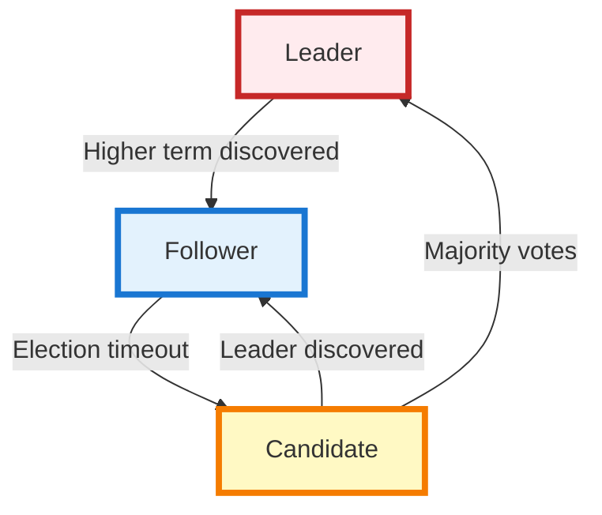
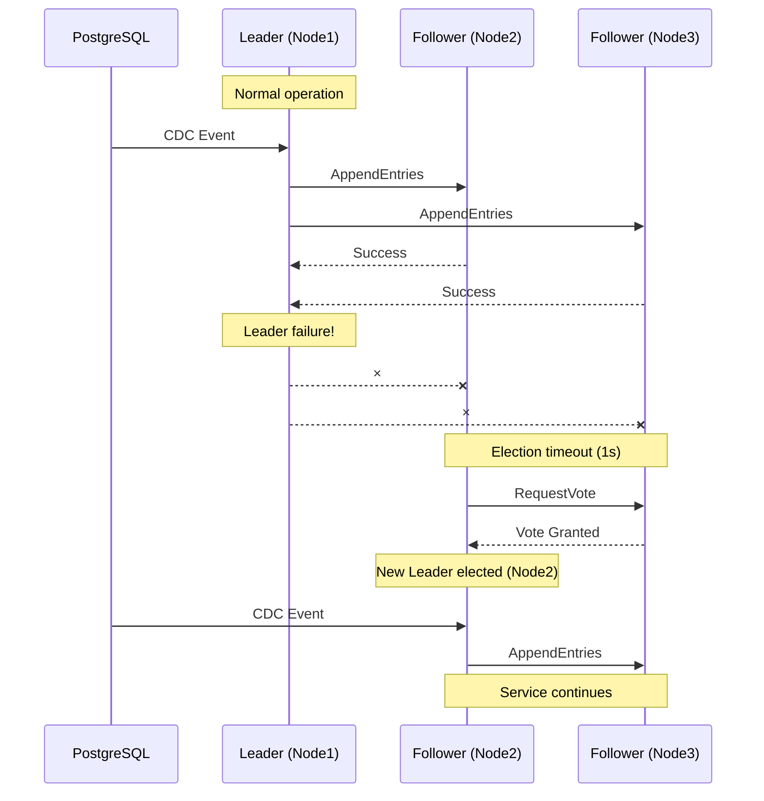
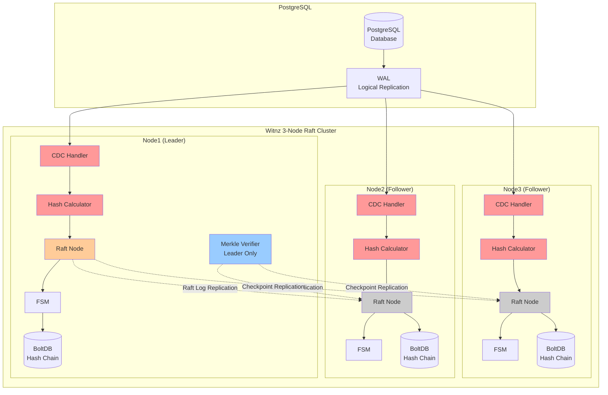

# Building a Distributed Tamper Detection System with Raft

## Introduction

In our [previous article](https://dev.to/sena_moriwaki_2c3fc4534e4/i-built-an-audit-system-in-a-single-15mb-binary-that-even-dbas-cant-fool-51f5), we introduced Witnz, a PostgreSQL tamper detection system. We covered change detection via Logical Replication, tamper prevention using hash chains, and efficient verification with Merkle Trees.

However, a single-server monitoring system has a critical flaw: **if the monitor fails, tamper detection stops**. Verification processing also imposes significant computational costs.

This article explores how we solved these problems using the **Raft consensus algorithm**, from selection rationale to implementation details.

## What is Raft?

Raft is a distributed consensus algorithm published in 2013 by Diego Ongaro and John Ousterhout. Designed to address Paxos's complexity, Raft prioritizes **understandability** as its primary goal.

### Three Core Mechanisms

Raft consists of three clearly separated mechanisms:

#### 1. Leader Election
A single node becomes Leader, coordinating all write operations. When the Leader fails, remaining nodes automatically elect a new Leader.

#### 2. Log Replication
The Leader records client requests as log entries and replicates them to Followers. Once a majority acknowledges the log, it becomes "committed."

#### 3. Safety Guarantees
Committed log entries are never lost. Only nodes with the most complete log can become Leader, ensuring data consistency.



Each node maintains one of three states with **clear transition rules**. This simplicity makes Raft both understandable and implementable.

## Common Raft Use Cases

Raft is proven in production across many distributed systems:

**Distributed Key-Value Stores:**
- **etcd**: Kubernetes backend
- **Consul**: Service discovery and configuration

**Distributed Databases:**
- **CockroachDB**: Global distributed SQL
- **TiDB**: MySQL-compatible distributed database

**Orchestration:**
- Kubernetes (via etcd)
- HashiCorp Nomad

**Tamper Detection (Witnz):**
Our PostgreSQL monitoring system represents a novel application of Raft.

## Raft vs Paxos - Why Raft?

While Paxos has proven track record, we chose Raft for its **simplicity and lightweight nature**.

### Implementation Simplicity

**Paxos (Multi-Paxos):**
```
Phase 1: Prepare/Promise
  - Proposer → Acceptors: Prepare(n)
  - Acceptors → Proposer: Promise(n, accepted_value)

Phase 2: Accept/Accepted
  - Proposer → Acceptors: Accept(n, value)
  - Acceptors → Proposer: Accepted(n, value)

Plus: Leader election, log gap filling, membership changes
must be implemented separately
```

**Raft:**
```go
// Core Raft RPC (simplified)
type AppendEntriesRequest struct {
    Term         int      // Leader's term
    LeaderID     string   // Leader ID
    PrevLogIndex int      // Previous log index
    PrevLogTerm  int      // Previous log term
    Entries      []Entry  // Log entries to replicate
    LeaderCommit int      // Leader's commit index
}

// Single RPC handles heartbeat, log replication, and commit notification
```

Raft's `AppendEntries` RPC handles heartbeat, log replication, and commit notification through one unified interface, dramatically simplifying implementation.

### Size Comparison

| Metric | Paxos | Raft |
|--------|-------|------|
| HashiCorp Raft implementation | - | ~10K lines |
| Witnz integration code | - | ~1K lines |
| Paper length | Paxos Made Simple: 14p | Raft: 16p (diagram-heavy) |

Using [HashiCorp Raft](https://github.com/hashicorp/raft), we integrated a Raft cluster in just ~1,000 lines of code.

## Why Witnz Needs Raft

### 1. Fault Tolerance

For tamper detection, **continuous monitoring is critical**. A single server has these risks:

- Hardware failure causing service outage
- Network partition causing unreachability
- Downtime during maintenance

A 3-node Raft cluster solves these problems:



**How it works:**
- Leader (Node1) fails → remaining 2 nodes maintain quorum (2/3)
- New Leader (Node2) elected within 1 second
- PostgreSQL CDC stream continues on new Leader
- **Zero downtime tamper detection**

### 2. Optimizing Verification Using Leader Trust

Raft has an interesting property: **the Leader's data is always correct**. We leverage this "feudal" trust model to reduce Merkle Tree verification overhead.

#### CDC Processing: All Nodes

All nodes process PostgreSQL CDC events:

```
Leader:    PostgreSQL CDC → Hash → Raft replication
Follower1: PostgreSQL CDC → Hash → Replication attempt (fails) → Receive via Raft
Follower2: PostgreSQL CDC → Hash → Replication attempt (fails) → Receive via Raft
```

**Why process on all nodes?**

During Leader election (several seconds), INSERTs in PostgreSQL are received by all nodes. If Followers ignored CDC events, **data during election would be lost**.

Processing on all nodes ensures:
- CDC events continue during Leader failure
- Immediate Raft replication upon new Leader election
- **Zero data loss**

#### Merkle Tree Verification: Leader Only

Periodic Merkle Tree verification runs **only on the Leader**:

```
Leader:    Periodic verification (every 5 min) → Build Merkle Tree → Replicate checkpoint
Follower1: Skip verification → Receive checkpoint only
Follower2: Skip verification → Receive checkpoint only

Verification cost = O(n) × 1 node (Leader)
```

**Why Leader-only?**

Merkle Tree verification can be delayed without issue—tampering is detected retroactively. This design **reduces cluster verification cost by ~2/3** while maintaining detection reliability.

### 3. Additional Benefits

#### High Availability via All-Node CDC Processing

Each node maintains its own PostgreSQL Logical Replication slot, processing all CDC events:

```go
func (h *RaftHashChainHandler) HandleChange(event *cdc.ChangeEvent) error {
    // All nodes process CDC events
    dataHash := calculateDataHash(event.NewData)

    // Leader: Raft replication succeeds
    // Follower: Raft replication fails, waits for replication from leader
    if err := h.raftNode.ApplyLog(logEntry); err != nil {
        if !h.raftNode.IsLeader() {
            // Follower: will receive via Raft
            return nil
        }
        return err
    }
    return nil
}
```

This design maintains CDC streams during Leader failure, resuming Raft replication immediately after new Leader election.

#### Strong Consistency for Reliable Detection

Raft provides **linearizability**, critical for tamper detection:

- All nodes maintain identical hash chains
- Tampering is detected unless majority of nodes compromised
- Verification produces same result on any node

#### Automated Failover Reduces Operational Costs

Traditional redundancy (e.g., active/standby) requires manual failover. Raft provides:

- Automatic Leader failure detection (heartbeat timeout: 1s)
- Automatic new Leader election (completes within seconds)
- No application restart required
- No human intervention needed

This enables **24/7 monitoring** with automatic recovery during off-hours.

## Architecture and Implementation

### Overall Architecture

Witnz data flow:



### Hash Chain Replication Implementation

Let's examine how Raft replicates hash chains through code.

#### Step 1: All Nodes Process CDC Events

[internal/verify/handler_raft.go](internal/verify/handler_raft.go):
```go
type RaftHashChainHandler struct {
    *HashChainHandler
    raftNode *consensus.Node
}

func (h *RaftHashChainHandler) HandleChange(event *cdc.ChangeEvent) error {
    // All nodes process CDC events to avoid data loss during leader election
    dataHash := calculateDataHash(event.NewData)

    // Get sequence number
    latestEntry, _ := h.storage.GetLatestHashEntry(event.TableName)
    var seqNum uint64 = 1
    if latestEntry != nil {
        seqNum = latestEntry.SequenceNum + 1
    }

    // Create Raft log entry
    logEntry := &consensus.LogEntry{
        Type:      consensus.LogEntryHashChain,
        TableName: event.TableName,
        Data: map[string]interface{}{
            "sequence_num":   float64(seqNum),
            "data_hash":      dataHash,
            "operation_type": string(event.Operation),
            "record_id":      fmt.Sprintf("%v", event.PrimaryKey),
        },
        Timestamp: time.Now(),
    }

    // Only the leader can apply logs to Raft
    if err := h.raftNode.ApplyLog(logEntry); err != nil {
        if !h.raftNode.IsLeader() {
            // Follower: hash calculated but not replicated (will receive via Raft)
            return nil
        }
        return fmt.Errorf("failed to replicate via raft: %w", err)
    }

    return nil
}
```

Key points:
1. **All nodes process CDC events** - prevents data loss during Leader failure
2. **All nodes calculate hashes** - ready for immediate Leader transition
3. **Only Leader's `ApplyLog()` succeeds** - Followers get "not the leader" error
4. **Followers eventually receive via Raft** - ensures majority replication

#### Step 2: Raft Node Replicates Logs

[internal/consensus/node.go](https://github.com/Anes1032/witnz/tree/main/internal/consensus/node.go):
```go
func (n *Node) ApplyLog(entry *LogEntry) error {
    // Reject if not Leader
    if n.raft.State() != raft.Leader {
        return fmt.Errorf("not the leader")
    }

    // Serialize log entry
    data, err := json.Marshal(entry)
    if err != nil {
        return fmt.Errorf("failed to marshal log entry: %w", err)
    }

    // Raft Apply: waits for majority replication (10s timeout)
    future := n.raft.Apply(data, 10*time.Second)
    if err := future.Error(); err != nil {
        return fmt.Errorf("failed to apply log: %w", err)
    }

    return nil
}
```

`raft.Apply()` is **synchronous**, blocking until majority (2/3 nodes) replication completes. When it returns successfully, the hash entry is guaranteed saved to the cluster.

#### Step 3: All FSMs Apply Logs

The Raft Finite State Machine (FSM) runs on all nodes, applying replicated log entries in order.

[internal/consensus/fsm.go](https://github.com/Anes1032/witnz/tree/main//internal/consensus/fsm.go):
```go
type FSM struct {
    storage *storage.Storage
    mu      sync.RWMutex
}

func (f *FSM) Apply(log *raft.Log) interface{} {
    f.mu.Lock()
    defer f.mu.Unlock()

    var entry LogEntry
    if err := json.Unmarshal(log.Data, &entry); err != nil {
        return fmt.Errorf("failed to unmarshal log entry: %w", err)
    }

    switch entry.Type {
    case LogEntryHashChain:
        return f.applyHashChain(&entry)
    case LogEntryCheckpoint:
        return f.applyCheckpoint(&entry)
    default:
        return fmt.Errorf("unknown log entry type: %s", entry.Type)
    }
}

func (f *FSM) applyHashChain(entry *LogEntry) interface{} {
    hashEntry := &storage.HashEntry{
        TableName:     entry.TableName,
        SequenceNum:   uint64(entry.Data["sequence_num"].(float64)),
        DataHash:      entry.Data["data_hash"].(string),
        Timestamp:     entry.Timestamp,
        OperationType: entry.Data["operation_type"].(string),
        RecordID:      entry.Data["record_id"].(string),
    }

    // Save to BoltDB (all nodes save identical data)
    if err := f.storage.SaveHashEntry(hashEntry); err != nil {
        return err
    }

    return nil
}
```

This FSM implementation ensures:
- **All nodes apply logs in same order** - Raft guarantees ordering
- **Leader-calculated hash stored as-is** - Followers don't recalculate
- **Deterministic state transitions** - same log produces same state

#### Data Flow Summary

```
[PostgreSQL INSERT]
    ↓
[All Nodes: CDC Handler] ← All nodes receive CDC event
    ↓
[All Nodes: Hash Calculation] ← All nodes calculate hash
    ↓
[Create Raft Log Entry]
    ↓
[Leader: Raft.Apply() succeeds] → Replicate to majority (2/3)
[Follower: Raft.Apply() fails] → "not the leader" error, wait for Raft delivery
    ↓
[FSM.Apply() - All Nodes] ← Save Leader-calculated hash
    ↓
[BoltDB Hash Chain - All Nodes]
```

**During Leader failure:**
```
[PostgreSQL INSERT during leader failure]
    ↓
[All Nodes: CDC Handler continues] ← No data loss
    ↓
[New Leader Election (1-2s)]
    ↓
[New Leader: Raft.Apply() succeeds] → Replication resumes
```

This design achieves distributed tamper detection with high availability.

## Conclusion

We explored Raft consensus in Witnz, our PostgreSQL tamper detection system.

### Why Raft?

1. **Simplicity**: More understandable than Paxos, integrated in just 1K lines
2. **Lightweight**: HashiCorp Raft is only ~10K lines
3. **Fault tolerance**: 3-node cluster handles 1-node failure automatically
4. **Leader trust model**: Leader-only hash calculation reduces compute by 2/3
5. **Operational automation**: Auto-failover and recovery enable 24/7 monitoring

### Distributed Tamper Detection Achieved

Raft enabled a fault-tolerant tamper detection system:

- **High availability**: Service continues despite 1-node failure
- **Strong consistency**: Identical hash chains across all nodes
- **Computational efficiency**: Leader-only verification eliminates redundancy
- **Automatic recovery**: No human intervention required

**Next article: We'll explore Merkle Trees for efficient verification.**

---

**Related Links:**
- [Previous article: PostgreSQL Tamper Detection System Design](https://dev.to/sena_moriwaki_2c3fc4534e4/i-built-an-audit-system-in-a-single-15mb-binary-that-even-dbas-cant-fool-51f5)
- [Witnz GitHub Repository](https://github.com/Anes1032/witnz)
- [Raft Paper](https://raft.github.io/raft.pdf)
- [HashiCorp Raft](https://github.com/hashicorp/raft)
