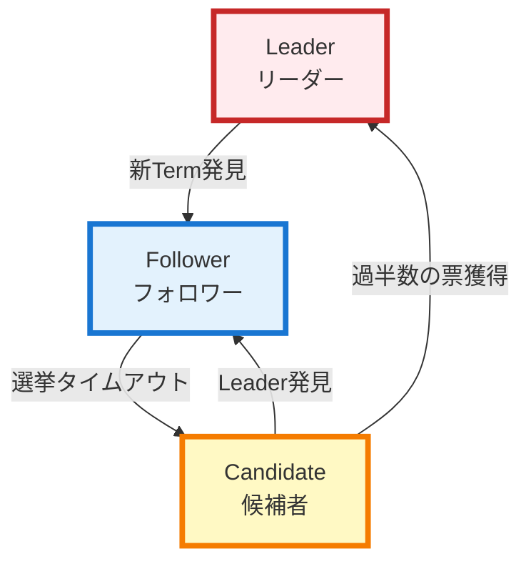
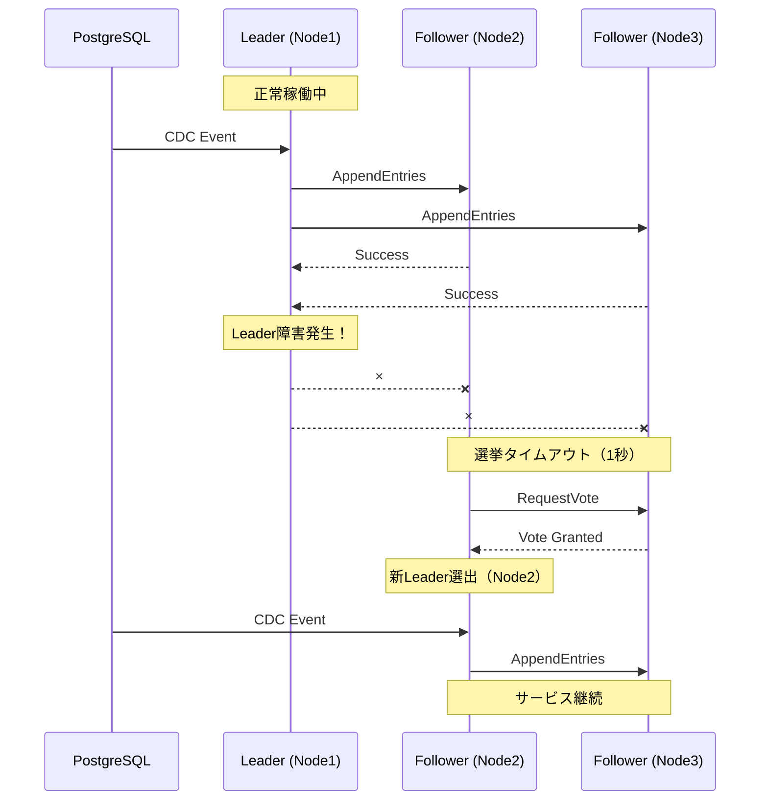
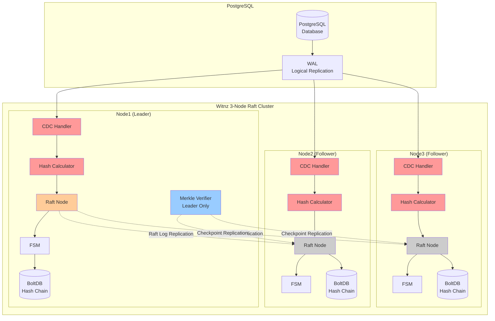

# Raftで実現する分散改ざん検知システム - PostgreSQL監視の信頼性を高める

## はじめに

[前回の記事](https://zenn.dev/anes1032/articles/fad1573ca329d4)では、PostgreSQLの改ざん検知システム「Witnz」の基本設計について紹介しました。Logical Replicationを使った変更検知、ハッシュチェーンによる改ざん防止、Merkle Treeを用いた効率的な検証といった仕組みを解説しました。

しかし、単一サーバーで動作する監視システムには大きな課題があります。**監視サーバー自体が障害で停止してしまえば、重要な改ざん検知が継続できません**。また、検証処理の計算コストも無視できない問題です。

今回は、これらの課題を解決するために導入した**分散合意アルゴリズムRaft**について、その選定理由から実装の詳細まで深掘りします。

## Raftとは

Raftは、2013年にDiego OngaroとJohn Ousterhoutによって発表された分散合意アルゴリズムです。従来のPaxosアルゴリズムの「理解しにくさ」を解決するために設計され、**"Understandability"（理解しやすさ）** を最重要目標としています。

### Raftの3つの主要メカニズム

Raftは以下の3つの明確に分離されたメカニズムで構成されています：

#### 1. Leader Election（リーダー選出）
クラスタ内の1台のノードがLeaderとして選出され、すべての書き込み処理を統括します。Leaderが故障すると、残りのノードが自動的に新しいLeaderを選出します。

#### 2. Log Replication（ログ複製）
Leaderはクライアントからのリクエストをログエントリとして記録し、Followerノードに複製します。過半数のノードがログを受信・保存したら、そのエントリは「コミット済み」となります。

#### 3. Safety（安全性保証）
一度コミットされたログエントリは失われません。Leader選出時には、最も完全なログを持つノードのみがLeaderになれるという制約により、データの一貫性が保証されます。



**状態遷移のポイント：**
- **実線の矢印**: 状態が変化する（Leaderを頂点とした三角形の遷移）
- **点線の矢印**: 自己ループ（同じ状態を維持）

Raftでは各ノードが3つの状態のいずれかを取り、**明確な状態遷移ルール**に従って動作します。この単純さが、Raftの理解しやすさと実装しやすさの源です。

## Raftの主なユースケース

Raftは多くの分散システムで採用されており、その信頼性が実証されています：

### 分散Key-Valueストア
- **etcd**: Kubernetesのバックエンドとして使用される分散KVS
- **Consul**: サービスディスカバリと設定管理を提供

### 分散データベース
- **CockroachDB**: グローバル分散SQLデータベース
- **TiDB**: MySQL互換の分散データベース

### 設定管理・オーケストレーション
- Kubernetes（etcd経由）
- HashiCorp Nomad

### **改ざん検知システム（Witnz）**
そして今回の主題である、PostgreSQLの改ざん検知システムです。この用途でRaftを使うのは比較的珍しいケースですが、後述する理由から最適な選択でした。

## Raft vs Paxos - なぜRaftを選んだか

分散合意アルゴリズムとして、Paxosは長年の実績があります。しかし、Witnzでは**実装のシンプルさと軽量性**を重視し、Raftを選択しました。

### 実装のシンプルさ

**Paxosの場合**（Multi-Paxos）：
```
Phase 1: Prepare/Promise
  - Proposer → Acceptors: Prepare(n)
  - Acceptors → Proposer: Promise(n, accepted_value)

Phase 2: Accept/Accepted
  - Proposer → Acceptors: Accept(n, value)
  - Acceptors → Proposer: Accepted(n, value)

さらに、リーダー選出、ログの穴埋め、メンバーシップ変更などを
独自に実装する必要がある
```

**Raftの場合**：
```go
// Raftの中心的なRPC（簡略化）
type AppendEntriesRequest struct {
    Term         int      // Leaderの任期
    LeaderID     string   // LeaderのID
    PrevLogIndex int      // 前のログエントリのインデックス
    PrevLogTerm  int      // 前のログエントリの任期
    Entries      []Entry  // 複製するログエントリ
    LeaderCommit int      // Leaderのコミットインデックス
}

// これ1つでハートビート、ログ複製、コミット通知を兼ねる
```

Raftでは`AppendEntries`という単一のRPCで、ハートビート、ログ複製、コミット通知をすべて処理します。この統一されたインターフェースが実装を大幅に簡素化します。

### 軽量性の比較

実装の規模も大きく異なります：

| 項目 | Paxos系 | Raft |
|-----|---------|------|
| HashiCorp Raft実装 | - | 約10,000行 |
| Witnzの統合コード | - | 約1,000行 |
| 理解に必要な論文の長さ | Paxos Made Simple: 14p | Raft論文: 16p（図表豊富） |

Witnzでは[HashiCorp Raft](https://github.com/hashicorp/raft)ライブラリを使用しており、わずか約1,000行のコードでRaftクラスタを統合できました。これは実装のシンプルさを如実に表しています。

## Witnzへの導入理由

### 1. 障害耐性の必要性

改ざん検知システムにとって、**監視の継続性は最も重要な要件**です。単一サーバーでは以下のリスクがあります：

- ハードウェア障害によるサービス停止
- ネットワーク分断による到達不可
- メンテナンス時のダウンタイム

Raftの3ノードクラスタを導入することで、これらの問題を解決しました：



**実際の動作**：
- Leader（Node1）が故障しても、残り2ノードで過半数（2/3）を維持
- 1秒以内に自動的に新Leader（Node2）が選出される
- PostgreSQLからのCDCストリームは新Leaderが引き継ぐ
- **ダウンタイムなしで改ざん検知が継続**

### 2. Leaderのデータ正確性を利用した検証処理の最適化

Raftの興味深い特性として、「**Leaderの持つデータは常に正しい**」という「封建的」な信頼モデルがあります。この特性を活用し、Merkle Tree検証処理の負荷を削減しました。

#### CDC処理：全ノードで実行

PostgreSQLからのCDCイベント処理は、**すべてのノードで実行**します：

```
Leader:    PostgreSQL CDC → ハッシュ計算 → Raft複製
Follower1: PostgreSQL CDC → ハッシュ計算 → Raft複製試行（失敗）→ Raft経由で受信
Follower2: PostgreSQL CDC → ハッシュ計算 → Raft複製試行（失敗）→ Raft経由で受信
```

**なぜ全ノードで処理するのか？**

Leader障害時、新しいLeaderが選出されるまで数秒かかります。その間にPostgreSQLで発生したINSERTは、どのノードもCDCイベントとして受信します。もしFollowerがCDCイベントを無視する設計だと、**Leader選出までの間のデータが失われます**。

全ノードで処理することで：
- Leader障害中もCDCイベントを受信し続ける
- 新Leaderが選出されたら即座にRaft複製を再開
- **データロスなし**で監視を継続

#### Merkle Tree検証：Leaderのみで実行

一方、定期的なMerkle Tree検証処理は、**Leaderのみ**が実行します：

```
Leader:    定期検証（5分ごと）→ Merkle Tree構築 → チェックポイント複製
Follower1: 検証スキップ → チェックポイント受信のみ
Follower2: 検証スキップ → チェックポイント受信のみ

検証コスト = O(n) × 1ノード（Leader）
```

**なぜLeaderのみで良いのか？**

Merkle Tree検証は、仮にLeader障害中に実施されなくても、次回の定期実行で検証できます。改ざんは過去に遡って検知可能なため、**多少の遅延は許容**できます。

この設計により、**クラスタ全体の検証コストを約1/3に削減**しながら、改ざん検知の信頼性は維持されます。

### 3. その他の利点

#### 全ノードでのCDC処理による可用性向上

PostgreSQLのLogical Replicationスロットは各ノードが独立に持ち、**すべてのノード**がCDCイベントを処理します：

```go
func (h *RaftHashChainHandler) HandleChange(event *cdc.ChangeEvent) error {
    // All nodes process CDC events
    dataHash := calculateDataHash(event.NewData)

    // Leader: Raft replication succeeds
    // Follower: Raft replication fails, waits for replication from leader
    if err := h.raftNode.ApplyLog(logEntry); err != nil {
        if !h.raftNode.IsLeader() {
            // Follower: will receive via Raft
            return nil
        }
        return err
    }
    return nil
}
```

この設計により、Leader障害中もCDCストリームを継続受信でき、新Leader選出後すぐにRaft複製を再開できます。

#### 強一貫性による改ざん検知の信頼性

Raftは**線形一貫性（Linearizability）**を提供します。これは改ざん検知において重要です：

- 全ノードが同一のハッシュチェーンを持つことが保証される
- 過半数のノードが破壊されない限り、改ざんは必ず検知される
- どのノードで検証しても同じ結果が得られる

#### 自動フェイルオーバーによる運用コスト削減

従来の冗長化構成（例：アクティブ/スタンバイ）では、障害時に手動でフェイルオーバーする必要がありました。Raftでは：

- Leader障害を自動検知（ハートビートタイムアウト：1秒）
- 自動的に新Leaderを選出（選挙完了：数秒以内）
- アプリケーションの再起動不要
- 人間の介入不要

これにより、夜間・休日の障害でも自動復旧し、**24/365の監視継続**が実現できます。

## アーキテクチャと実装

### 全体アーキテクチャ

Witnzのデータフローは以下の通りです：



### ハッシュチェーンのレプリケーション実装

実際のコードを見ながら、Raftによるハッシュチェーン複製の仕組みを理解しましょう。

#### Step 1: 全ノードでCDCイベントを処理

[internal/verify/handler_raft.go](internal/verify/handler_raft.go):
```go
type RaftHashChainHandler struct {
    *HashChainHandler
    raftNode *consensus.Node
}

func (h *RaftHashChainHandler) HandleChange(event *cdc.ChangeEvent) error {
    // All nodes process CDC events to avoid data loss during leader election
    // Each node calculates hash and attempts Raft replication

    dataHash := calculateDataHash(event.NewData)

    // シーケンス番号の取得
    latestEntry, _ := h.storage.GetLatestHashEntry(event.TableName)
    var seqNum uint64 = 1
    if latestEntry != nil {
        seqNum = latestEntry.SequenceNum + 1
    }

    // Raftログエントリの作成
    logEntry := &consensus.LogEntry{
        Type:      consensus.LogEntryHashChain,
        TableName: event.TableName,
        Data: map[string]interface{}{
            "sequence_num":   float64(seqNum),
            "data_hash":      dataHash,
            "operation_type": string(event.Operation),
            "record_id":      fmt.Sprintf("%v", event.PrimaryKey),
        },
        Timestamp: time.Now(),
    }

    // Only the leader can apply logs to Raft
    // Followers will receive "not the leader" error and skip replication
    if err := h.raftNode.ApplyLog(logEntry); err != nil {
        if !h.raftNode.IsLeader() {
            // Follower: hash is calculated but not replicated (will receive via Raft)
            slog.Debug("CDC event processed on follower, waiting for Raft replication",
                "table", event.TableName,
                "seq", seqNum)
            return nil
        }
        return fmt.Errorf("failed to replicate via raft: %w", err)
    }

    slog.Info("Raft consensus: hash chain entry replicated",
        "table", event.TableName,
        "seq", seqNum)
    return nil
}
```

このコードのポイント：
1. **全ノードがCDCイベントを処理** - Leader障害中のデータロスを防止
2. **全ノードがハッシュ計算を実行** - Leader切り替え時に即座に対応可能
3. **Leaderのみ`ApplyLog()`成功** - Followerは"not the leader"エラーで早期リターン
4. **Followerは最終的にRaft経由で受信** - 過半数への複製を保証

#### Step 2: Raftノードがログを複製

[internal/consensus/node.go](https://github.com/Anes1032/witnz/tree/main/internal/consensus/node.go):
```go
func (n *Node) ApplyLog(entry *LogEntry) error {
    // Leader以外は拒否
    if n.raft.State() != raft.Leader {
        return fmt.Errorf("not the leader")
    }

    // ログエントリをJSON化
    data, err := json.Marshal(entry)
    if err != nil {
        return fmt.Errorf("failed to marshal log entry: %w", err)
    }

    // Raft Apply: 過半数のノードに複製完了まで待機（タイムアウト10秒）
    future := n.raft.Apply(data, 10*time.Second)
    if err := future.Error(); err != nil {
        return fmt.Errorf("failed to apply log: %w", err)
    }

    return nil
}
```

`raft.Apply()`は**同期的に動作**します。過半数（2/3ノード）への複製が完了するまでブロックし、成功/失敗を返します。これにより、関数が正常終了した時点で「ハッシュエントリがクラスタに保存された」ことが保証されます。

#### Step 3: 全ノードのFSMがログを適用

Raft Finite State Machine (FSM) は、すべてのノードで実行される状態マシンです。Leaderが複製したログエントリを、各ノードのFSMが順番に適用していきます。

[internal/consensus/fsm.go](https://github.com/Anes1032/witnz/tree/main//internal/consensus/fsm.go):
```go
type FSM struct {
    storage *storage.Storage
    mu      sync.RWMutex
}

func (f *FSM) Apply(log *raft.Log) interface{} {
    f.mu.Lock()
    defer f.mu.Unlock()

    // ログエントリをデコード
    var entry LogEntry
    if err := json.Unmarshal(log.Data, &entry); err != nil {
        return fmt.Errorf("failed to unmarshal log entry: %w", err)
    }

    // エントリタイプに応じて処理
    switch entry.Type {
    case LogEntryHashChain:
        return f.applyHashChain(&entry)
    case LogEntryCheckpoint:
        return f.applyCheckpoint(&entry)
    default:
        return fmt.Errorf("unknown log entry type: %s", entry.Type)
    }
}

func (f *FSM) applyHashChain(entry *LogEntry) interface{} {
    // ログエントリからハッシュエントリを構築
    hashEntry := &storage.HashEntry{
        TableName:     entry.TableName,
        SequenceNum:   uint64(entry.Data["sequence_num"].(float64)),
        DataHash:      entry.Data["data_hash"].(string),
        Timestamp:     entry.Timestamp,
        OperationType: entry.Data["operation_type"].(string),
        RecordID:      entry.Data["record_id"].(string),
    }

    // BoltDBに保存（全ノードで同じデータを保存）
    if err := f.storage.SaveHashEntry(hashEntry); err != nil {
        return err
    }

    return nil
}
```

このFSMの実装により：
- **全ノードが同じ順序でログを適用** - Raftが順序を保証
- **Leaderが計算したハッシュ値をそのまま保存** - Followerは再計算不要
- **決定論的な状態遷移** - 同じログから同じ状態が再現される

#### データフローのまとめ

```
[PostgreSQL INSERT]
    ↓
[All Nodes: CDC Handler] ← 全ノードがCDCイベント受信
    ↓
[All Nodes: Hash Calculation] ← 全ノードでハッシュ計算
    ↓
[Raft Log Entry作成]
    ↓
[Leader: Raft.Apply() 成功] → 過半数（2/3）への複製
[Follower: Raft.Apply() 失敗] → "not the leader"エラー、Raft経由で受信待ち
    ↓
[FSM.Apply() - 全ノード] ← Leaderが複製したハッシュ値を保存
    ↓
[BoltDB Hash Chain - 全ノード]
```

**Leader障害時の動作**:
```
[PostgreSQL INSERT during leader failure]
    ↓
[All Nodes: CDC Handler継続受信] ← データロスなし
    ↓
[New Leader Election (1-2秒)]
    ↓
[New Leader: Raft.Apply() 成功] → 複製再開
```

この設計により、可用性を保ちながら分散改ざん検知を実現できます。

## まとめ

本記事では、PostgreSQL改ざん検知システム「Witnz」における分散合意アルゴリズムRaftの導入について解説しました。

### Raft採用の決め手

1. **実装のシンプルさ**: Paxosに比べて理解しやすく、わずか1,000行で統合完了
2. **軽量性**: HashiCorp Raftライブラリは約10K行と小規模
3. **障害耐性**: 3ノードクラスタで1ノード障害に自動対応
4. **Leader信頼モデル**: Leaderのみがハッシュ計算し、Followerは保存のみ → 計算量1/3削減
5. **運用の自動化**: 自動フェイルオーバー、自動ノード復旧で24/365監視を実現

### 分散改ざん検知の実現

Raftにより、単一障害点のない改ざん検知システムが実現できました：

- **高可用性**: 1ノード障害でもサービス継続
- **強一貫性**: 全ノードで同一のハッシュチェーンを保証
- **計算効率**: Leader OnlyのCDC処理で無駄を削減
- **自動復旧**: 人間の介入なしで障害から回復

**次回の記事では、Merkle Treeについて解説しようと考えています。**

---

**関連リンク**:
- [前回記事: PostgreSQL改ざん検知システムの設計](https://zenn.dev/anes1032/articles/fad1573ca329d4)
- [Witnz GitHubリポジトリ](https://github.com/Anes1032/witnz)
- [Raft論文（原文）](https://raft.github.io/raft.pdf)
- [HashiCorp Raft](https://github.com/hashicorp/raft)
