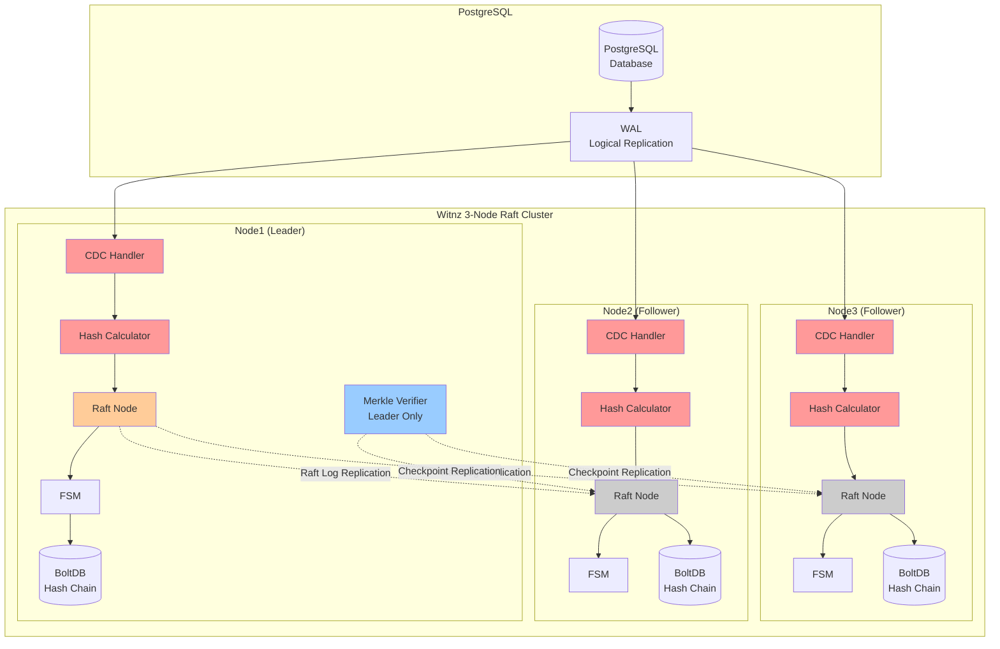

# 15MBのバイナリ1つで、DBAすら騙せない監査システムを作った

## はじめに

監査で「データが改竄されていないことを証明して」と言われたら、何を出しますか？

アクセスログ？バックアップ？pgauditの出力？

**でも、そのログを出力したDBA自身が不正をしていたら、どう検知します？**

DBAは神（Superuser）です。データを書き換え、証拠となるログをもみ消す権限を持っています。「管理者を信用するしかない」——本当にそれでいいのでしょうか？

この問いに対して、**Kafka不要、専用DB不要、追加のサーバーも不要、難しい設定も不要、たった15MBのバイナリ1つ**で答えを出すOSS「Witnz」を作りました。

https://github.com/Anes1032/witnz

## 5秒でわかる Witnz

攻撃者が本来変更されるはずのないデータを改竄しようとした時の挙動です。


DBのトランザクションログ（WAL）を外部から監視し、「誰が書き込んだか」に関わらず、不正な変更を**即座に検知**します。

## 既存ソリューションとの比較

「改竄検知」と聞いて思い浮かぶものと比較してみます。

| ソリューション | 導入コスト | 追加インフラ | DBA不正検知 | 検証速度 |
|---------------|----------|-------------|------------|---------|
| pgaudit | 低 | なし | ❌ ログ自体を消せる | N/A |
| Hyperledger Fabric | 極高 | Kafka, CouchDB, CA... | ⚠️ 過剰すぎる | 遅い |
| immudb | 中 | 専用DB必須 | ⚠️ DBマイグレーション必要 | 中 |
| Amazon QLDB | 中 | AWS依存 | ⚠️ ベンダーロックイン | 中 |
| 商用監査ツール | 高 | 専用サーバー | ⚠️ 製品による | 製品による |
| **Witnz** | **低** | **なし** | **✅** | **高速 (数秒)** |

Witnzは「ブロックチェーンライクの信頼モデル」を、**アプリケーションサーバーのサイドカーとしてポン置きできる軽量さ**で実現します。

## なぜDBA不正を検知できるのか

ポイントは「**DBの外側から監視し、分散合意で証跡をロックする**」という設計です。



### 二重の防御層

Witnzは**2層の検知メカニズム**を持っています：

#### 第1層：リアルタイムWAL監視（即座）
- PostgreSQLのLogical Replicationから変更イベントを受信
- `UPDATE` / `DELETE` を**即座に検知**してアラート
- DBAがログを消しても、WALの時点で既にWitnzが検知済み

#### 第2層：Merkle Root検証（定期・高速）
- 定期的にDBから全レコードを**1回のクエリで取得**してMerkle Rootを計算
- 保存済みのMerkle Root Checkpointと**即座に比較**
- **Logical Replicationをすり抜けた改竄も検知**：
  - DBファイルの直接書き換え
  - ノード停止中の手動SQL実行
  - 改竄されたバックアップからのリストア
  - 監視対象外の方法で追加されたレコード（Phantom Insert）

Merkle Treeは、ビットコインやGitでも使われる「大量データの完全性を1つのハッシュ値で表現する」技術です。Witnzはこれを監査ログに応用し、**1回のDB問い合わせで検証を完了**することで、スケーラビリティ問題を解決しました。

### 分散合意による改竄耐性

- **Raftで分散合意**（3台以上推奨、1ノードでも動作可能）
- ノード群が「あるべきDBの状態（Hash ChainとMerkle Root）」を共有
- **BoltDB内蔵**: 証跡の保存先は各ノード内のBoltDB。外部DBへの依存ゼロ

つまり、**DBAがDBを改竄しても、Raftノード群が持つ「正解」と一致しないため即座にバレる**という仕組みです。

## 技術スタック：シンプルさの追求

```
- 言語: Go（クロスコンパイル容易）
- DB連携: PostgreSQL Logical Replication (jackc/pglogrepl)
- コンセンサス: Raft (hashicorp/raft)
- ストレージ: BoltDB (etcd-io/bbolt)
- ハッシュ: SHA256 + Merkle Tree
- バイナリサイズ: ~15MB
```

**追加インフラ一切不要**。Kafkaもいらない、専用DBもいらない、Java VMもいらない。

## 保護モード：Append-onlyテーブル向け

Witnzは**監査ログやトランザクション履歴など、追記専用テーブル**の保護に特化しています。

```yaml
protected_tables:
  - name: audit_logs
    verify_interval: 30m  # 30分ごとにMerkle Root検証

  - name: financial_transactions
    verify_interval: 10m  # 高頻度検証
```

#### Merkle Rootチェックポイントの仕組み

```
レコード1: Hash(data1) = "a3f5..."
レコード2: Hash(data2) = "b8e1..."
レコード3: Hash(data3) = "c2d9..."
         ↓
    Merkle Tree構築
         ↓
   Merkle Root: "9a3e..."  ← これを保存

検証時:
  1. SELECT * FROM table
  2. Merkle Root計算
  3. 現在のMerkle Root == 保存されたMerkle Root？
    ✅ 一致 → 全レコード完全一致
    ❌ 不一致 → Merkle Tree探索で改竄箇所を特定
```

### 検知できる攻撃

| 攻撃シナリオ | 検知方法 | 検知タイミング | パフォーマンス |
|------------|---------|--------------|---------------|
| `UPDATE` / `DELETE` via SQL | Logical Replication | **即座** | リアルタイム |
| DBファイルの直接書き換え | Merkle Root検証 | **次回検証時** | 高速（数秒） |
| ノード停止中の改竄 | Merkle Root検証 | **起動時** | 高速（数秒） |
| Phantom Insert（監視外の追加） | Merkle Root検証 | **次回検証時** | 高速（数秒） |
| 改竄されたバックアップからのリストア | Merkle Root検証 | **次回検証時** | 高速（数秒） |

## 導入の流れ（1ノード構成）

### 1. PostgreSQLでLogical Replicationを有効化

```sql
-- 確認
SHOW wal_level;  -- 'logical' であればOK

-- もし違う場合は postgresql.conf を編集
-- wal_level = logical
-- max_replication_slots = 10
-- max_wal_senders = 10
-- 再起動が必要
```

### 2. Witnzをダウンロード

```bash
# Linux (amd64)
curl -sSL https://github.com/Anes1032/witnz/releases/latest/download/witnz-linux-amd64 \
  -o /usr/local/bin/witnz
chmod +x /usr/local/bin/witnz

# macOS (arm64)
curl -sSL https://github.com/Anes1032/witnz/releases/latest/download/witnz-darwin-arm64 \
  -o /usr/local/bin/witnz
chmod +x /usr/local/bin/witnz

witnz version
```

### 3. 設定ファイルを作成

```yaml
# witnz.yaml
database:
  host: ${DB_HOST}           # e.g., "postgres" or "prod-db.example.com"
  port: ${DB_PORT}           # e.g., 5432
  database: ${DB_NAME}       # e.g., "witnzdb"
  user: ${DB_USER}           # e.g., "witnz"
  password: ${DB_PASSWORD}   # Use environment variable

  hash:
  algorithm: sha256

node:
  id: node1
  bind_addr: node1:7000
  grpc_addr: 0.0.0.0:8000
  data_dir: /data
  bootstrap: true
  peer_addrs: []  # 1ノード構成の場合は空

protected_tables:
  - name: audit_log
    verify_interval: 30m  # 30分ごとにMerkle Root検証

  - name: financial_transactions
    verify_interval: 10m  # 高頻度検証

alerts:
  enabled: true
  slack_webhook: ${SLACK_WEBHOOK_URL}
```

### 4. 起動

```bash
# 初回のみ：Replication SlotとPublicationを作成
witnz init --config witnz.yaml

# 起動
witnz start --config witnz.yaml

# ステータス確認
witnz status --config witnz.yaml

# 手動検証（100万レコードでも数秒）
witnz verify --config witnz.yaml
```

**これだけです。** たった15MBのバイナリ1つで、スケーラブルな監査システムが動き始めます。

## 3ノード構成で耐障害性を強化

本番環境では**3ノード以上**を推奨します。

**ノード1（Bootstrap）**:
```yaml
node:
  id: node1
  bootstrap: true
  bind_addr: node1:7000
  peer_addrs:
    node2: node2:7000
    node3: node3:7000
```

**ノード2、3（Follower）**:
```yaml
node:
  id: node2  # node3の場合は id: node3
  bootstrap: false
  bind_addr: node2:7000  # node3の場合は node3:7000
  peer_addrs:
    node1: node1:7000
    node3: node3:7000  # 各ノードでpeerを調整
```

Raftコンセンサスにより、1ノードが落ちても残りのノードで動作継続します。

## Dockerで試す

手元で試したい方はこちら：

```bash
git clone https://github.com/Anes1032/witnz.git
cd witnz
docker-compose up
```

3つのWitnzノードが立ち上がり、PostgreSQLへの変更監視が始まります。

## なぜ「軽量」にこだわるのか

監査ツールが複雑だと、結局導入されずに終わります。

- **Hyperledger Fabric**: 素晴らしい技術だが、Kafka、CouchDB、CA、MSPと複雑すぎる
- **immudb**: 専用DBへの移行コストが高い
- **商用ツール**: エージェント、サーバー、ライセンス管理...

Witnzは「**監査の本質だけ**」を抽出して、**1バイナリで完結**させました。

```
✅ PostgreSQLだけあればOK（RDS/Aurora/Cloud SQL対応）
✅ 追加インフラ不要
✅ 設定ファイル1つ
✅ systemdで起動してあとは放置
```

「とりあえず入れてみるか」で試せる軽さと、エンタープライズグレードのスケーラビリティを両立しています。

この二重構造により：
- ✅ リアルタイム検知の速さ
- ✅ 定期検証のスケーラビリティ
- ✅ 外部証明への拡張性

を同時に実現しています。

## セキュリティ考慮事項

### Raftリーダーノードの侵害

Witnzには根本的な制限があります：Raftリーダーノードがroot権限で侵害された場合、フォロワーが受け入れる偽のハッシュ値を送信できます。
ただし、これには以下が必要です：
- リーダーノードのサーバーへのroot権限
- 実行中のバイナリを改変、または改竄版で再起動する能力

## 他のソリューションにも同じことが当てはまる

| ソリューション | サーバーRoot侵害 |
|----------|----------------------|
| **Witnz** | 攻撃者はLeaderノードの改竄が可能 |
| **immudb** | 攻撃者は改竄データの保存と送信が可能 |
| **Amazon QLDB** | AWS権限を持った攻撃者はすべての実行権限をもつ |
| **Any software** | Root権限 = フルアクセスコントロール |

**ソフトウェアのみのソリューションでは、サーバーのroot権限侵害から保護することはできません。** これはimmudbを含むすべてのデータベース整合性ツールが共有する根本的な制限です。
唯一の理論的な保護は、ハードウェアベースの信頼の起点（TPM、AWS Nitro Enclave、Intel SGX）ですが、これはハードウェアベンダーを信頼する必要があります。

### Witnzが保護できるもの
- データベース管理者の不正行為（サーバーroot権限なしの場合）
- 監査レコードを変更するSQLインジェクション攻撃
- データベースファイルの直接改竄（Merkle Rootで検出）
- 不正な変更を引き起こすアプリケーションレベルのバグ

https://github.com/Anes1032/witnz
